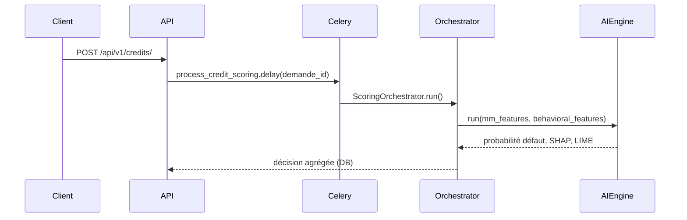

# Entraînement ML et intégration au backend Simbisa

Ce guide décrit comment entraîner le modèle XGBoost de scoring, déployer les artefacts sur le serveur Django, et vérifier que l’inférence fonctionne dans le pipeline de crédit.

---

## Vue d’ensemble

| Élément | Emplacement |
|---------|-------------|
| Code d’entraînement | `backend/mltraining/` |
| Script principal | `mltraining/src/train_xgboost.py` |
| Artefacts produits | `mltraining/models/` |
| Moteur d’inférence | `apps/scoring/engines/ai_engine.py` |
| Orchestration scoring | `apps/scoring/services.py` → `ScoringOrchestrator` |
| Tâche async | `apps/credits/tasks.py` → `process_credit_scoring` |

Le dossier `mltraining/` est **volontairement isolé** du runtime Django : vous pouvez entraîner sur une machine de data science sans installer toute la stack API.

---

## Prérequis

- Python 3.11+
- Environnement virtuel recommandé

```powershell
cd c:\Users\USER\Simbisa\backend
python -m venv .venv
.\.venv\Scripts\Activate.ps1
```

---

## Étape 1 — Installer les dépendances ML

**Windows + Python 3.13** : les versions épinglées anciennes (`scikit-learn==1.5.0`, etc.) ne compilent pas. Utilisez le fichier mis à jour :

```powershell
cd c:\Users\USER\Simbisa\backend
.\.venv\Scripts\Activate.ps1
pip install --default-timeout=600 -r mltraining\requirements_ml.txt
```

> Le paquet `xgboost` fait ~100 Mo — prévoyez une connexion stable ou relancez `pip` en cas de timeout.

Dépendances principales : `xgboost`, `scikit-learn`, `pandas`, `numpy`, `scipy`, `joblib`.

---

## Étape 2 — Lancer l’entraînement

Depuis la racine `backend/` (important pour les imports du module) :

```powershell
cd c:\Users\USER\Simbisa\backend
python -m mltraining.src.train_xgboost
```

### Ce que fait le script

1. Génère un jeu de données **synthétique** (5 000 lignes par défaut) si vous n’avez pas encore de données réelles.
2. Entraîne un classifieur XGBoost (défaut de crédit binaire).
3. Calcule un `StandardScaler` sur les features.
4. Sauvegarde les artefacts dans `mltraining/models/`.

### Features utilisées (14 variables)

Alignées avec `AIEngine._build_feature_vector()` :

| Feature | Source à l’inférence |
|---------|-------------------|
| `flux_entrants_moyen_usd` | Mobile Money |
| `flux_sortants_moyen_usd` | Mobile Money |
| `solde_moyen_mensuel` | Mobile Money |
| `regularite_revenus_pct` | Mobile Money |
| `volatilite_depenses_pct` | Mobile Money |
| `nb_mois_actifs` | Mobile Money |
| `progression_objectif_moy` | Comportemental (épargne) |
| `taux_remboursement_pct` | Comportemental |
| `nb_defauts` | Comportemental |
| `anciennete_jours` | Comportemental |
| `montant_demande` | Demande crédit |
| `duree_mois` | Demande crédit |
| `age` | Profil client |
| `revenu_estime` | Profil client |

### Artefacts générés

```
mltraining/models/
├── xgboost_v2.joblib       ← modèle actif (copié depuis la version datée)
├── xgboost_YYYYMMDD.joblib ← archive horodatée
├── scaler.joblib           ← StandardScaler
└── features.json           ← liste ordonnée des noms de colonnes
```

---

## Étape 3 — Entraîner sur vos propres données (production)

Pour remplacer les données synthétiques :

1. Exportez un CSV/Parquet depuis MySQL (historique demandes + scores + défauts).
2. Modifiez `generate_synthetic_data()` dans `train_xgboost.py` pour charger votre fichier.
3. Gardez **exactement** les 14 colonnes listées ci-dessus, dans le **même ordre** que `FEATURE_NAMES`.
4. Relancez l’entraînement et vérifiez les métriques (AUC-ROC, Brier) affichées dans les logs.

> **Important** : si vous ajoutez ou retirez une feature, mettez à jour `FEATURE_NAMES` dans le script **et** `AIEngine._build_feature_vector()` dans le backend, puis réentraînez.

---

## Étape 4 — Configurer le backend (.env)

Copiez `.env.example` vers `.env` et définissez les chemins des artefacts (relatifs à `backend/` ou absolus) :

```env
ML_MODEL_PATH=mltraining/models/xgboost_v2.joblib
ML_SCALER_PATH=mltraining/models/scaler.joblib
ML_FEATURES_PATH=mltraining/models/features.json
```

En Docker, le volume est déjà monté en lecture seule :

```yaml
# docker-compose.yml — service api / celery
./mltraining/models:/app/mltraining/models:ro
```

Les valeurs par défaut dans `config/settings/base.py` pointent vers `BASE_DIR/mltraining/models/` si les variables ne sont pas définies.

---

## Étape 5 — Vérifier le chargement du modèle

1. Démarrez l’API (voir [MYSQL_SETUP.md](./MYSQL_SETUP.md)).
2. Consultez les logs au premier scoring :

   - Succès : `Modèle XGBoost chargé : .../xgboost_v2.joblib`
   - Fichiers absents : `Modèle ML introuvable — mode simulation activé.`

### Mode simulation (fallback)

Si les fichiers `.joblib` / `features.json` sont introuvables, `AIEngine` utilise `_simulate_prediction()` : scores plausibles mais **non issus du vrai modèle**. Utile pour le développement frontend, **pas** pour la production.

---

## Étape 6 — Intégration dans le flux métier



1. Le client soumet une demande → statut `en_analyse`.
2. Celery exécute les 4 moteurs (règles, mobile money, comportemental, **IA**).
3. L’agrégateur calcule le score global et la décision (`approuve`, `refuse`, `revue_manuelle`).
4. Optionnel : mémo RAG via `POST /api/v1/rag/memo/{demande_id}/` (agent).

**Prérequis Celery** : Redis doit tourner (`REDIS_URL` dans `.env`). Sans worker Celery, la demande reste bloquée en `en_analyse`.

```powershell
# Terminal 1 — API
python manage.py runserver

# Terminal 2 — Worker
celery -A config worker -l info -Q default,scoring,rag
```

---

## Étape 7 — Tester manuellement le scoring IA

En tant qu’**Agent de crédit** ou **Responsable crédit** (JWT) :

```bash
curl -X POST http://localhost:8000/api/v1/scoring/42/trigger/ \
  -H "Authorization: Bearer <access_token>"
```

Consultation du résultat :

```bash
curl http://localhost:8000/api/v1/scoring/42/ \
  -H "Authorization: Bearer <access_token>"
```

Le client voit son dernier score via `GET /api/v1/scoring/me/`.

---

## Checklist déploiement production

| # | Action |
|---|--------|
| 1 | Entraîner et valider AUC / calibration sur données réelles |
| 2 | Copier `xgboost_v2.joblib`, `scaler.joblib`, `features.json` sur le serveur |
| 3 | Vérifier `ML_*_PATH` dans `.env` production |
| 4 | Monter le volume Docker `mltraining/models` (lecture seule) |
| 5 | Démarrer Celery worker + beat |
| 6 | Tester un scoring E2E et confirmer `modele_utilise` ≠ `simulation` dans la réponse |
| 7 | Surveiller les logs `scoring` et Sentry (`SENTRY_DSN`) |

---

## Dépannage

| Problème | Cause probable | Solution |
|----------|----------------|----------|
| `modele_utilise: simulation` | Fichiers ML absents ou chemin incorrect | Vérifier `.env` et existence des 3 fichiers |
| `FileNotFoundError` au chargement | Chemin relatif depuis un autre CWD | Utiliser chemins absolus ou `BASE_DIR` |
| Scoring jamais terminé | Celery/Redis arrêté | Lancer worker + vérifier `REDIS_URL` |
| Erreur SHAP/LIME | Version incompatible | `pip install -r requirements/base.txt` côté API |
| Scores incohérents | Features training ≠ inference | Aligner les 14 variables et `features.json` |

---

## Références code

- Entraînement : `mltraining/src/train_xgboost.py`
- Inférence : `apps/scoring/engines/ai_engine.py`
- Settings : `config/settings/base.py` (`ML_MODEL_PATH`, etc.)
