# Modélisation Simbisa — BDD, Backend, Frontends Web & Mobile

Document de référence pour l'architecture métier et technique de la plateforme **Simbisa Rawbank** (micro-crédit intelligent, RDC).

---

## 1. Vue d'ensemble

| Couche | Technologie | Rôle |
|--------|-------------|------|
| **Frontend Web** | React 18 + Vite | SPA multi-rôles (client, agent, manager, risque, admin, auditeur) — **branché API** |
| **Frontend Mobile** | Flutter 3 + Riverpod + go_router | App **client** Android/iOS — UI complète, **intégration API en cours** (mock local) |
| **API** | Django 5 + DRF | REST `/api/v1/`, JWT, RBAC 6 rôles |
| **BDD** | MySQL 8 | Données métier relationnelles |
| **Cache** | Redis / LocMem (dev) | OTP, taux CDF, throttling |
| **Async** | Celery | Scoring crédit (optionnel) |
| **ML** | XGBoost + scikit-learn | Score IA, SHAP/LIME |
| **IA** | OpenAI + RAG | Mémos crédit ancrés politiques Rawbank |
| **USSD** | Passerelle simulée | Menu *123# (MSISDN = téléphone) |

---

## 2. Modèle de données (MySQL)

### 2.1 Domaines principaux

```
authentication   → Utilisateur, Role
clients          → Client, Identite (KYC)
wallets          → WalletRawbank, MobileMoneyAccount, MobileMoneyTransaction
savings          → CompteEpargne, OperationEpargne
credits          → DemandeCredit, Credit, Echeance, Remboursement, CreditException
scoring          → ScoreRegle, ScoreMobileMoney, ScoreComportemental, ScoreIA, DecisionCredit, ScoringRule
rag              → VectorDocument
audit            → AuditLog
core             → PlatformConfig
ussd             → UssdProfile, UssdInteractionLog
```

### 2.2 Territoire Kinshasa (règle métier clé)

- **24 communes** codées (`gombe`, `limete`, `ngaliema`, …) — voir `apps/core/kinshasa_communes.py`.
- **Agent de crédit** : `Utilisateur.commune_kinshasa` — une commune par agent ; **plusieurs agents peuvent partager la même commune**.
- **Client** : `Client.commune_kinshasa` + `Client.id_agent_assigne` → **un seul agent responsable** (portefeuille).
- **Inscription en ligne** : répartition à l'agent actif le **moins chargé** de la commune.
- **CRUD client (agent)** : Create / Read / Update sur **ses** clients ; **Delete réservé à l'Administrateur**.

### 2.3 Cardinalités principales

| Relation | Cardinalité |
|----------|-------------|
| Role → Utilisateur | 1 — N |
| Utilisateur → Client | 1 — 0..1 |
| Agent → Client (portefeuille) | 1 — N |
| Commune → Agent | 1 — N |
| Client → DemandeCredit | 1 — N |
| DemandeCredit → Credit | 1 — 0..1 |
| DemandeCredit → DecisionCredit | 1 — 0..1 |
| Credit → Echeance / Remboursement | 1 — N |

---

## 3. Diagramme de classes UML

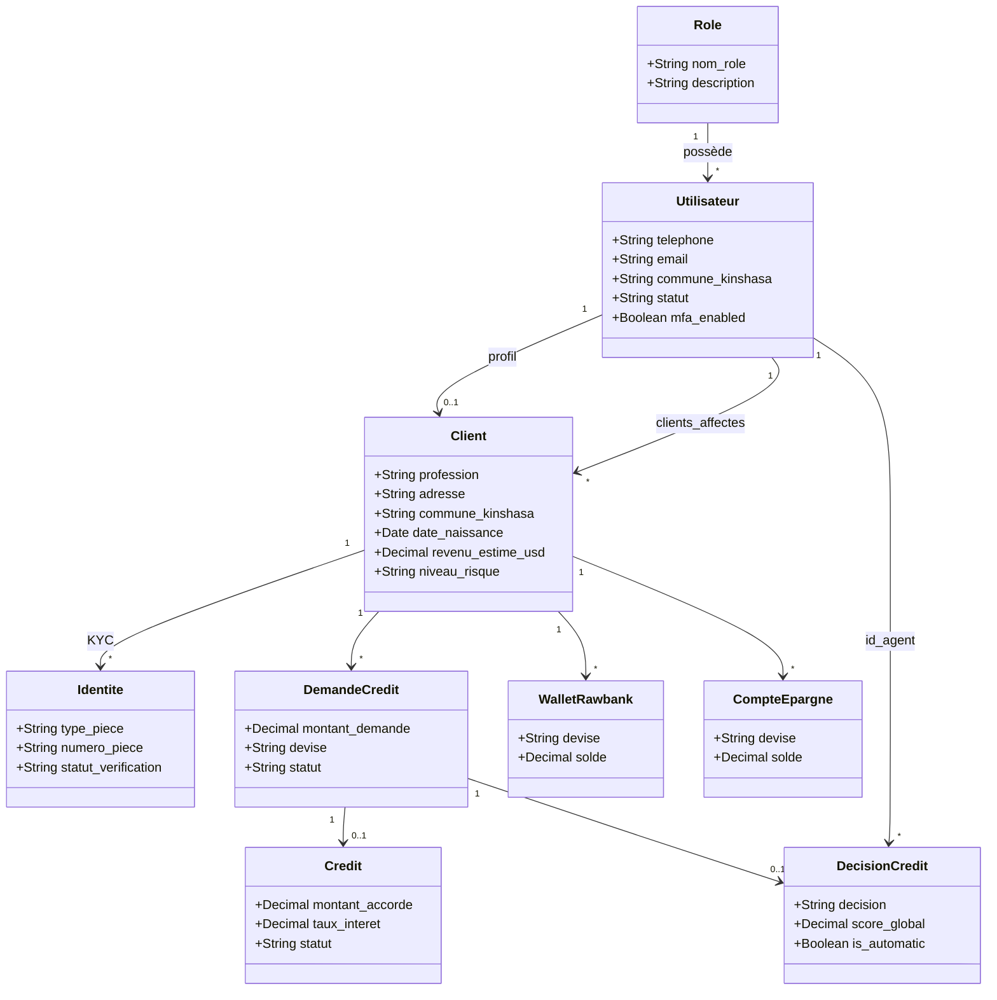

---

## 4. Diagrammes de séquence UML

### 4.1 Inscription client + affectation agent

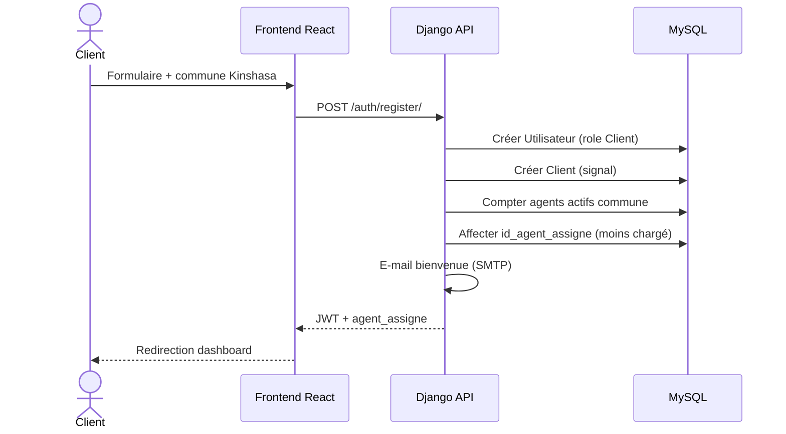

### 4.2 Agent — CRUD client (sans DELETE)

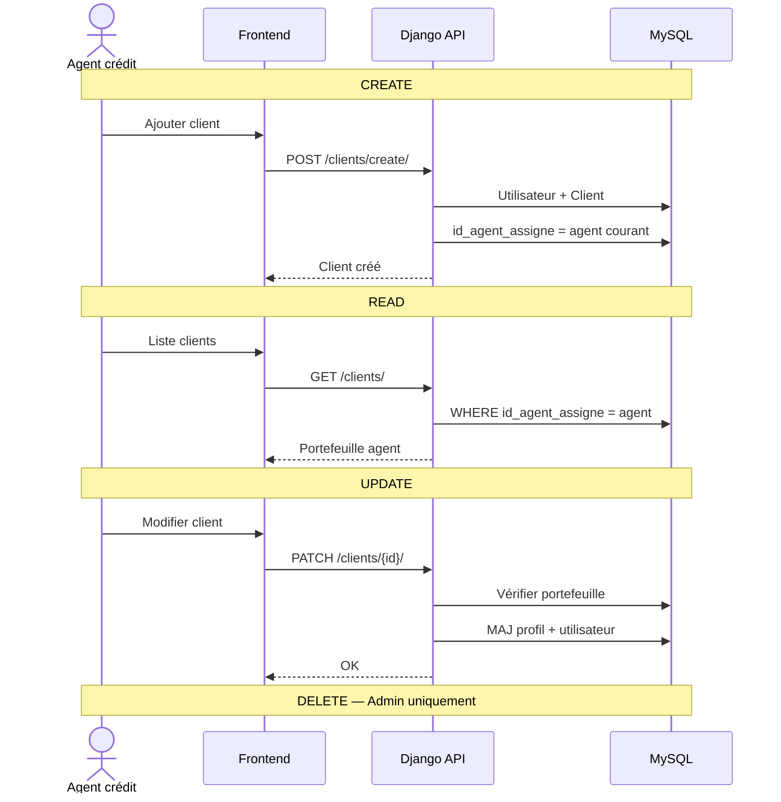

### 4.3 Demande de crédit + scoring

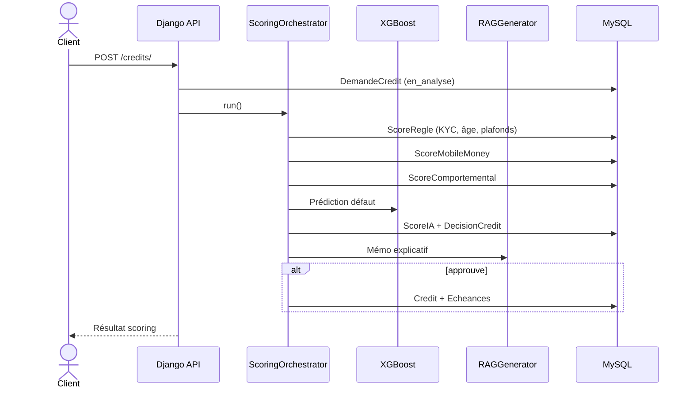

### 4.4 Connexion avec OTP e-mail

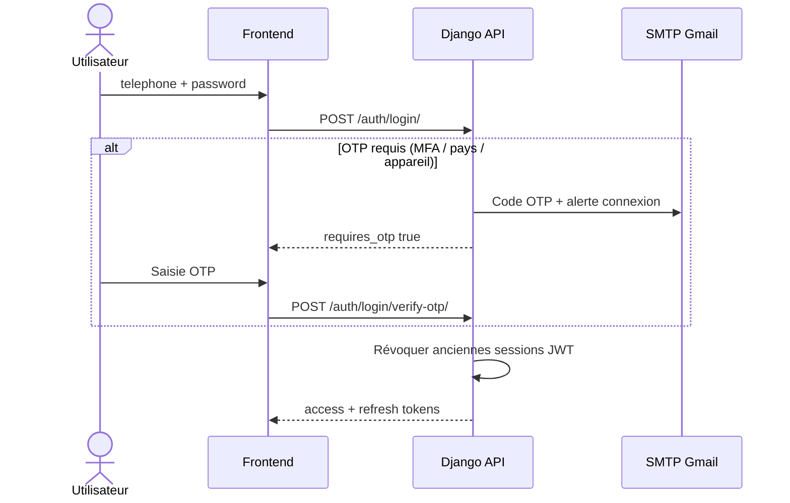

---

## 5. Diagramme de déploiement UML

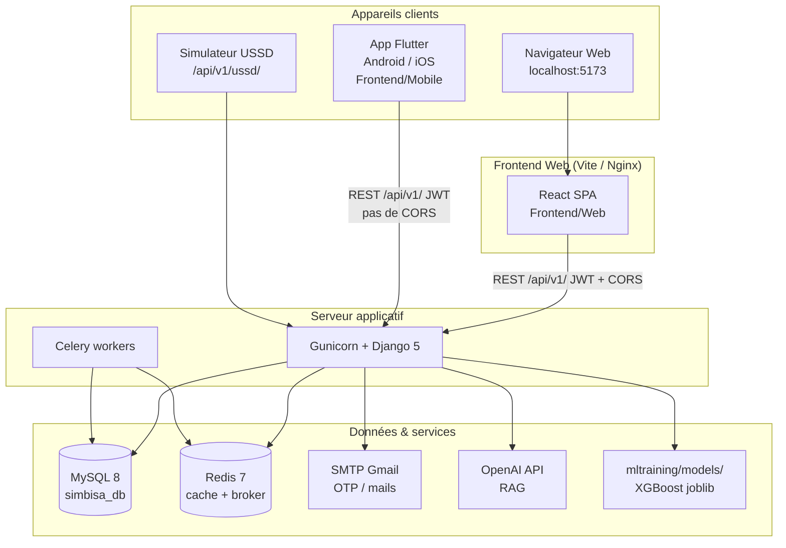

**URLs backend (dev)**

| Client | Base URL |
|--------|----------|
| Web (Vite proxy) | `http://localhost:5173` → proxy `/api` → `:8000` |
| Mobile émulateur Android | `http://10.0.2.2:8000` |
| Mobile appareil physique | `http://<IP-LAN-PC>:8000` |
| USSD simulateur | `http://localhost:8000/api/v1/ussd/` |

**Production (Docker)** : voir `docker-compose.yml` — services `web`, `celery`, `redis`, `db`, `nginx`.

---

## 6. Diagramme de temps (scoring crédit)

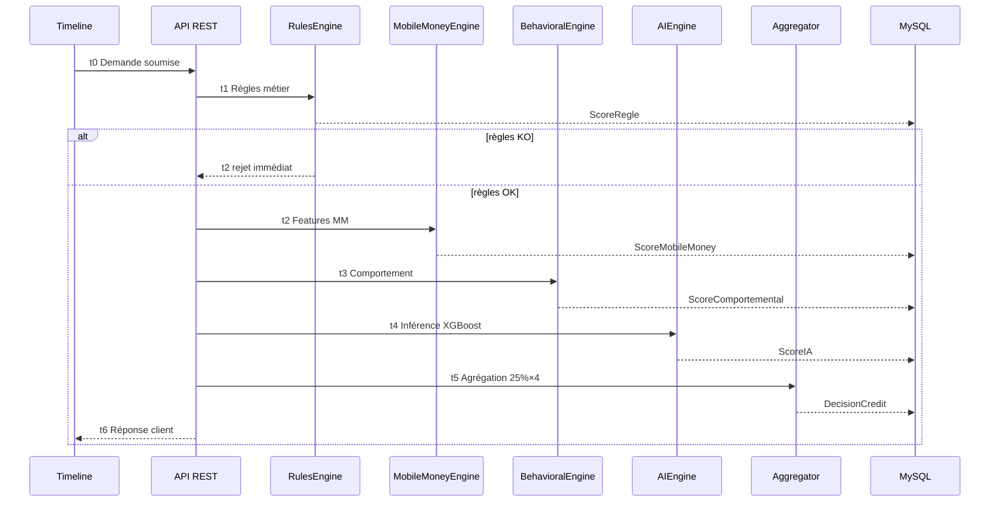

---

## 7. Diagramme d'activité UML

### 7.1 Parcours crédit (client → décision)

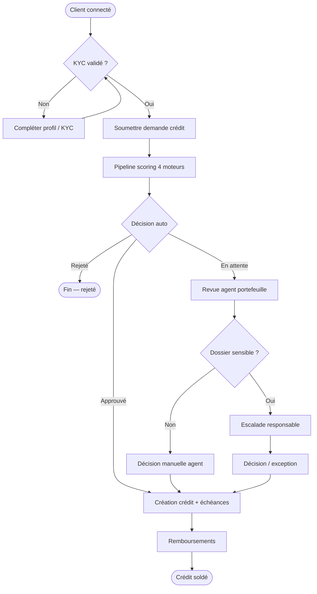

### 7.2 Gestion portefeuille agent

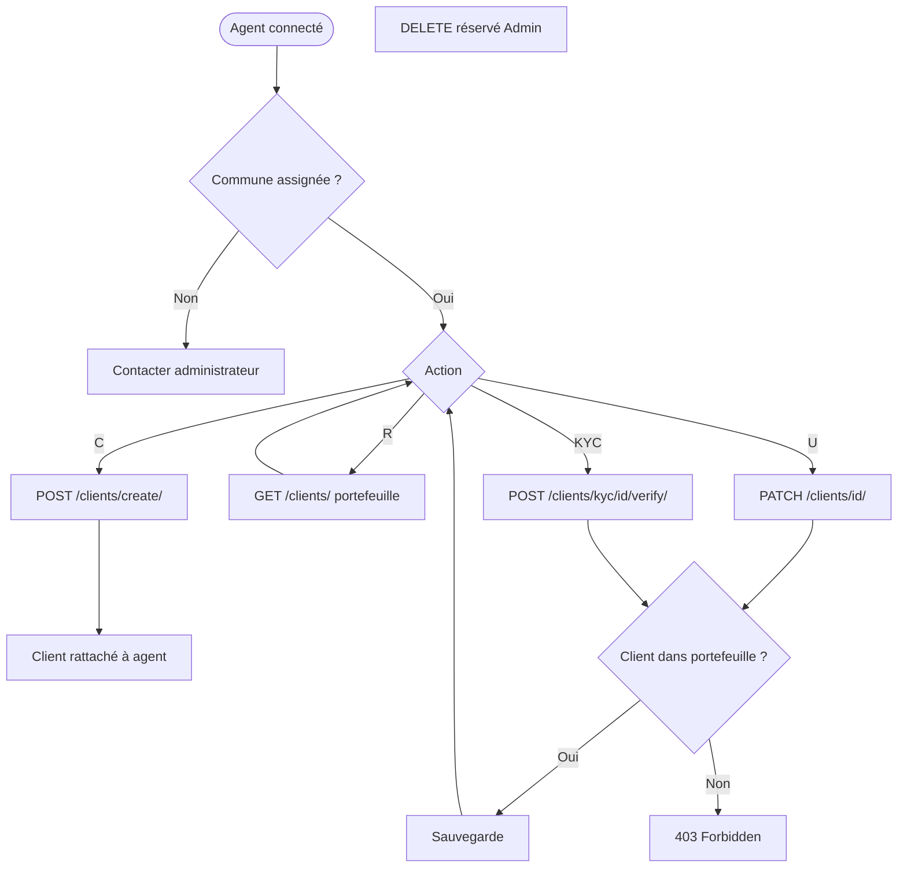

---

## 8. Backend — structure API

```
/api/v1/
├── auth/           login, register, MFA, reset password
├── clients/        CRUD portefeuille, communes, KYC
├── credits/        demandes client + staff (agent/manager)
├── scoring/        scores, trigger, règles
├── savings/        épargne virtuelle
├── wallets/        Rawbank + Mobile Money
├── manager/        exceptions, plafonds, dashboard
├── risk/           règles IA, modèles
├── admin/          users, rôles, communes agents
├── audit/          journal, décisions, rapports
├── settings/       taux, sécurité
├── ussd/           simulateur + callback
└── rag/            documents politique
```

### Permissions CRUD client

| Action | Client | Agent | Manager | Admin |
|--------|--------|-------|---------|-------|
| Lire soi-même | ✅ | — | — | — |
| Lire portefeuille | — | ✅ (siens) | ✅ (tous) | ✅ |
| Créer | — | ✅ (siens) | — | — |
| Modifier | ✅ (profil) | ✅ (siens) | ✅ | ✅ |
| Supprimer | — | ❌ | ❌ | ✅ |
| KYC valider | — | ✅ (siens) | ✅ | — |

---

## 9. Frontends — Web & Mobile

### 9.1 Vue comparative

| | **Web** (`Frontend/Web`) | **Mobile** (`Frontend/Mobile`) |
|--|--------------------------|--------------------------------|
| Stack | React 18, Vite, Tailwind | Flutter 3, Riverpod, go_router |
| Rôles | 6 rôles (client → auditeur) | **Client uniquement** |
| API | Intégrée (`src/api/`) | **Prévue** — écrans + `mock_data.dart` aujourd'hui |
| Auth | JWT + OTP e-mail + `device_id` | Login simulé (delay mock) |
| Navigation | React Router, sidebar par rôle | Bottom nav 5 onglets (`ClientShell`) |
| Cible | Desktop / tablette | Android APK, iOS (build Flutter) |

Les **agents, managers et admin** utilisent exclusivement le **frontend Web**. Le mobile couvre le parcours **client grand public** (inclusion financière terrain).

---

### 9.2 Frontend Web — structure

```
Frontend/Web/src/
├── api/              client.js, auth.js, clients.js, credits.js, …
├── pages/
│   ├── Register.jsx          commune + inscription + agent auto
│   ├── agent/AgentClients.jsx CRUD portefeuille
│   ├── AgentDashboard.jsx
│   ├── manager/ …
│   ├── admin/AdminUsers.jsx  affectation commune agents
│   └── audit/ …
├── components/       atoms, molecules, templates
├── context/          AuthContext (JWT)
└── constants/        roles.js, navigation.js
```

#### Routes Web par rôle

| Rôle | Route d'accueil | Fonctions clés |
|------|-----------------|----------------|
| Client | `/dashboard` | crédit, épargne, score |
| Agent | `/agent` | **mes clients**, demandes, KYC |
| Manager | `/manager` | sensibles, exceptions, plafonds |
| Analyste | `/risk` | règles, modèles |
| Admin | `/admin` | users, communes agents, settings |
| Auditeur | `/audit` | journal, rapports |

---

### 9.3 Frontend Mobile (Flutter) — structure

```
Frontend/Mobile/
├── lib/
│   ├── main.dart
│   ├── core/
│   │   ├── constants/     routes.dart, router.dart (go_router)
│   │   └── theme/         app_theme.dart, widgets.dart (design Simbisa)
│   ├── data/
│   │   └── mock/          mock_data.dart (UserModel, CreditModel, …)
│   └── features/
│       ├── auth/          login_screen, register_screen
│       ├── dashboard/     dashboard_screen, client_shell (bottom nav)
│       ├── credit/        credit_request_screen, my_credits_screen
│       ├── savings/       savings_screen
│       ├── scoring/       scoring_screen
│       └── profile/       profile_screen
├── assets/                fonts Sora, images
└── pubspec.yaml           go_router, flutter_riverpod, fl_chart
```

#### Navigation mobile (ClientShell)

| Index | Onglet | Écran | Route |
|-------|--------|-------|-------|
| 0 | Accueil | `DashboardScreen` | `/dashboard` |
| 1 | Crédit | `CreditRequestScreen` | `/credit-request` |
| 2 | Épargne | `SavingsScreen` | `/savings` |
| 3 | Scoring | `ScoringScreen` | `/scoring` |
| 4 | Profil | `ProfileScreen` | `/profile` |

Auth hors shell : `/login`, `/register`.

#### Endpoints API cibles (mobile client)

| Écran mobile | Méthode | Endpoint backend |
|--------------|---------|------------------|
| Login | POST | `/auth/login/` (+ OTP si requis) |
| Register | POST | `/auth/register/` (+ `commune_kinshasa`) |
| Profil / KYC | GET/PATCH, POST | `/clients/me/`, `/clients/me/identite/` |
| Wallets | GET | `/wallets/me/` |
| Mobile Money | GET/POST | `/wallets/mobile-money/` |
| Épargne | GET/POST | `/savings/`, `/savings/{id}/depot/`, `/retrait/` |
| Demande crédit | POST | `/credits/` |
| Mes crédits | GET | `/credits/me/` |
| Remboursement | POST | `/credits/{id}/remboursement/` |
| Score | GET | `/scoring/me/` |
| Refresh JWT | POST | `/auth/token/refresh/` |
| Communes | GET | `/clients/communes/` |

#### Diagramme de composants (mobile)

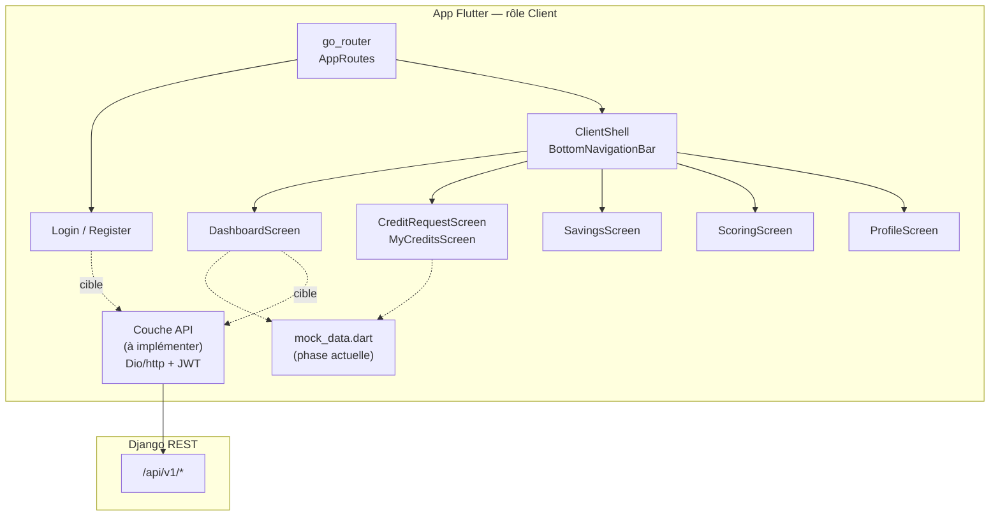

#### Séquence — parcours mobile client (cible API)

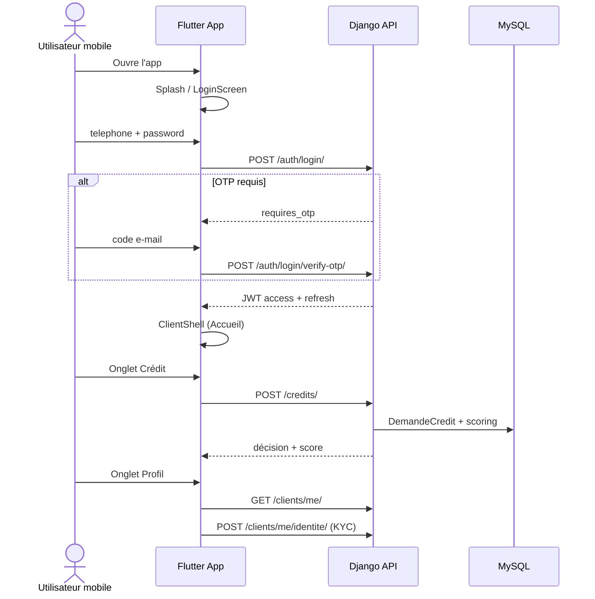

#### Activité — navigation mobile

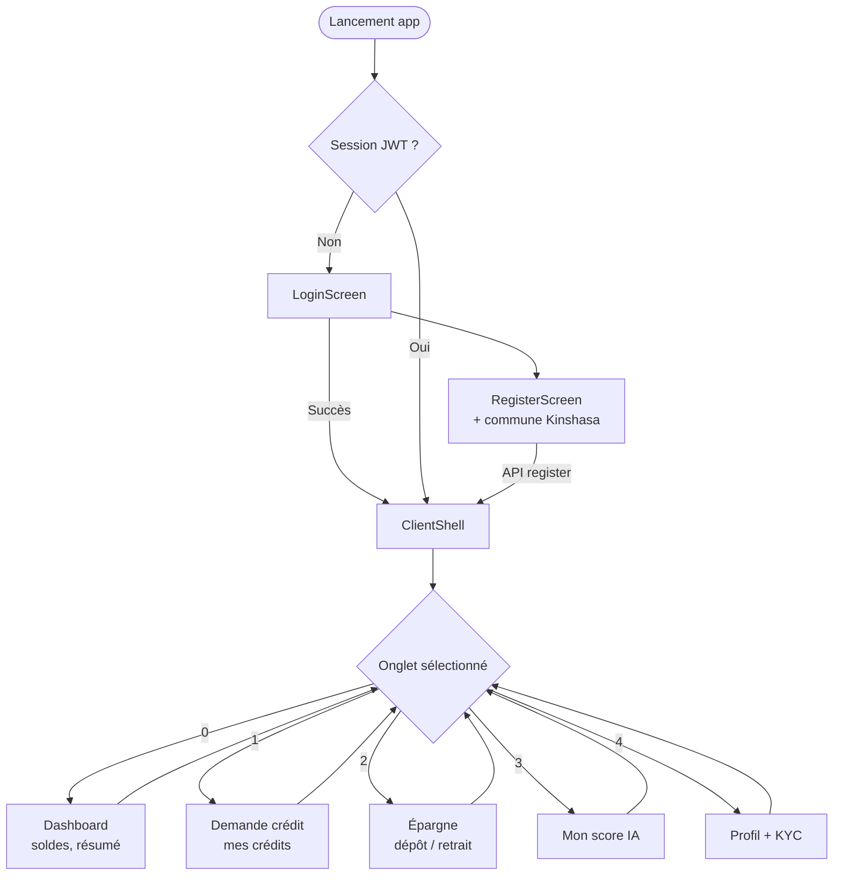

#### État d'intégration mobile

| Module | UI Flutter | API backend |
|--------|------------|-------------|
| Auth login/register | ✅ | ⏳ mock (navigation directe) |
| Dashboard | ✅ | ⏳ mock |
| Crédit | ✅ | ⏳ mock |
| Épargne | ✅ | ⏳ mock |
| Scoring | ✅ | ⏳ mock |
| Profil / KYC | ✅ | ⏳ mock |
| OTP / MFA | ❌ | ✅ backend prêt |
| Commune inscription | ❌ UI | ✅ backend prêt |

**Prochaine étape mobile** : couche `lib/data/api/` (Dio + intercepteur JWT), remplacer `mock_data.dart`, ajouter sélecteur commune à `register_screen.dart`.

---

## 10. Index & migrations

Migrations territoire :
- `authentication.0003_territoire_kinshasa` — `Utilisateur.commune_kinshasa`
- `clients.0002_territoire_kinshasa` — `Client.commune_kinshasa`, `Client.id_agent_assigne`

```powershell
cd backend
python manage.py migrate
python manage.py seed_demo --flush
```

---

## 11. Références

| Document | Contenu |
|----------|---------|
| [README.md](../README.md) | Installation backend |
| [SEEDERS.md](./SEEDERS.md) | Comptes demo |
| [API_INTEGRATION.md](../../Frontend/Web/docs/API_INTEGRATION.md) | Frontend Web ↔ API |
| [API_REFERENCE.md](./API_REFERENCE.md) | Référence REST Web + Mobile |
| [POSTMAN_GUIDE.md](./POSTMAN_GUIDE.md) | Endpoints détaillés |
| [USSD_SIMULATEUR.md](./USSD_SIMULATEUR.md) | Menu *123# |
| `Frontend/Mobile/pubspec.yaml` | Dépendances Flutter |

---

*Simbisa Rawbank — modélisation v1.2 — Web multi-rôles + Mobile Flutter client + territoire Kinshasa.*
