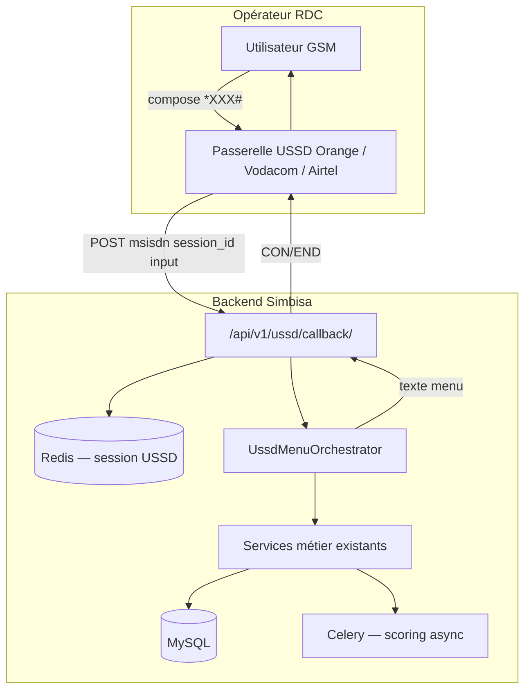

# Intégration USSD — Simbisa / Rawbank

Ce document décrit **comment faire évoluer le backend** pour supporter le canal **USSD** (*123#), en complément des API REST déjà utilisées par le web et le mobile.

---

## 1. Contexte USSD

| Caractéristique | Implication backend |
|-----------------|---------------------|
| Pas de navigateur | Pas de JWT stocké côté client ; sessions courtes côté serveur |
| Identité = **MSISDN** | Le `telephone` (`+243…`) est la clé primaire métier (déjà le `USERNAME_FIELD`) |
| Menus texte 182 car. max | Réponses courtes, pagination `1/2`, pas de JSON verbeux |
| Requêtes **callback** opérateur | Le telco appelle votre URL à chaque frappe utilisateur |
| Latence faible | Réponse &lt; 2 s ; scoring lourd → async + SMS de résultat |
| PIN 4–6 chiffres | Différent du mot de passe app ; hash dédié `ussd_pin` |

Le backend actuel est **déjà bien orienté USSD** : auth par téléphone, wallets dual-devise, crédit par devise, taux admin.

---

## 2. Architecture cible (recommandée)



### Principe : **ne pas dupliquer la logique métier**

Les vues USSD doivent appeler les **mêmes services** que REST :

| Action USSD | Service / code existant |
|-------------|-------------------------|
| Consulter solde wallet | `WalletRawbank` + `ensure_client_wallets` |
| Dépôt épargne | logique `depot_epargne_view` → extraire en `SavingsService` |
| Demande crédit | `DemandeSerializer` + `process_credit_scoring` |
| Consulter score | `score_client_agrege()` |
| Taux du jour | `get_cdf_per_usd()` |

Refactor progressif : extraire la logique des `views.py` vers `apps/*/services.py` pour que REST et USSD partagent le même code.

---

## 3. Nouveau module proposé : `apps/ussd/`

```
apps/ussd/
├── models.py          # UssdSessionLog (audit), optionnel UssdPin
├── session.py         # Gestion état Redis (menu, step, contexte)
├── menus/
│   ├── main.py        # Arbre de menus
│   ├── auth.py        # PIN / première visite
│   ├── wallet.py
│   ├── savings.py
│   └── credit.py
├── views.py           # callback HTTP opérateur
├── serializers.py     # Validation payload telco
├── urls.py
└── services.py        # Façade vers apps métier
```

### Endpoint callback (exemple)

```
POST /api/v1/ussd/callback/
```

**Payload typique (normaliser selon opérateur)** :

```json
{
  "session_id": "abc-123-opérateur",
  "msisdn": "+243900000010",
  "input": "1",
  "service_code": "*123#"
}
```

**Réponse attendue par le telco** :

```json
{
  "response_type": "CON",
  "message": "SIMBISA Rawbank\n1. Mon solde\n2. Epargne\n3. Credit\n0. Quitter"
}
```

| `response_type` | Signification |
|-----------------|---------------|
| `CON` | Continue — attend une nouvelle saisie |
| `END` | Termine la session |

---

## 4. Arbre de menus (MVP)

```
*123#  →  SIMBISA Rawbank
          1. Mon compte
             1. Solde USD
             2. Solde CDF
          2. Epargne
             1. Solde / objectif
             2. Depot (choix compte)
          3. Demande credit
             1. En USD
             2. En CDF
             → montant → duree (mois) → confirmation → scoring async
          4. Mon score
          5. Taux du jour (1 USD = X CDF)
          0. Quitter

Première visite ou option « Sécurité » :
          → saisie PIN USSD (4 chiffres, hash en base)
```

### Contraintes UX USSD

- Maximum **~140 caractères** par écran (prévoir 120 pour marge).
- Toujours proposer **0 = Retour** et **00 = Menu principal**.
- Montants : saisie numérique sans décimales pour CDF ; USD avec validation plage dynamique.
- Après demande crédit : message *« Demande enregistrée. Vous recevrez un SMS sous 2 min. »* (nécessite connecteur SMS — phase 2).

---

## 5. Authentification USSD

| Canal | Mécanisme |
|-------|-----------|
| REST / Mobile | JWT + mot de passe (+ MFA optionnel) |
| USSD | MSISDN (fourni par l’opérateur, **ne pas faire confiance sans IP whitelist**) + **PIN USSD** |

### Modèle suggéré (phase 1)

Ajouter sur `Utilisateur` ou `Client` :

```python
ussd_pin_hash = models.CharField(max_length=128, blank=True)
ussd_enabled = models.BooleanField(default=True)
```

- Enrôlement PIN : premier accès USSD ou paramètre dans l’app mobile.
- 3 échecs PIN → blocage USSD 30 min (comme `failed_login_attempts`).

### Sécurité callback

- Whitelist IP passerelles opérateur.
- Secret partagé header `X-USSD-Secret`.
- Idempotence `session_id` + `input` (éviter double soumission).
- Rate limit par `msisdn` (ex. 30 req/min).

---

## 6. Sessions USSD (Redis)

Clé : `ussd:session:{session_id}`

```json
{
  "msisdn": "+243900000010",
  "menu": "credit",
  "step": "montant",
  "devise": "CDF",
  "data": {},
  "created_at": "2026-06-03T10:00:00Z"
}
```

TTL : **90–180 secondes** (inactivité = fin de session).

Le REST stateless actuel **ne change pas** ; USSD ajoute une couche stateful légère.

---

## 7. Scoring et opérations lourdes

| Opération | Stratégie USSD |
|-----------|----------------|
| Consultation solde | Synchrone (&lt; 500 ms) |
| Dépôt épargne | Synchrone + transaction DB |
| Demande crédit | **Async** : enregistrer demande → Celery `process_credit_scoring` → SMS/push résultat |
| Score client | Synchrone si scores en cache ; sinon *« Score en cours de calcul »* |

Réutiliser `ScoringOrchestrator` et `score_client_agrege` sans modification majeure.

---

## 8. Dual-devise (USD / CDF) via USSD

- Menu crédit : choix explicite **1=USD / 2=CDF** avant le montant.
- Soldes : deux lignes ou sous-menu.
- Plages montant : `get_credit_limits(devise)` + taux `get_cdf_per_usd()` pour affichage *« Max: FC3375000 »*.
- Taux du jour : `GET /settings/taux-change/` équivalent interne.

---

## 9. Phases de mise en œuvre

### Phase 0 — Préparation (actuel)

- [x] Auth par `telephone`
- [x] Devises CDF/USD
- [x] Taux admin
- [ ] Seeders de test
- [ ] Extraire services métier des views

### Phase 1 — MVP USSD (2–3 sprints)

- [ ] App `ussd` + callback `POST /ussd/callback/`
- [ ] Sessions Redis + menu principal
- [ ] PIN USSD (hash)
- [ ] Consultation soldes + taux
- [ ] Demande crédit simplifiée (async + message fin)

### Phase 2 — Parité fonctionnelle

- [ ] Épargne dépôt/retrait USSD
- [ ] Historique crédit (dernière demande)
- [ ] SMS notification (Twilio / opérateur)
- [ ] Logs audit `channel=ussd`

### Phase 3 — Production telco

- [ ] Connecteurs par opérateur (Orange, Vodacom, Airtel)
- [ ] Certification passerelle
- [ ] Monitoring latence / taux d’abandon
- [ ] Load test (pics soirée)

---

## 10. Contrat avec les opérateurs (RDC)

Chaque opérateur expose un format légèrement différent. Prévoir un **adaptateur** :

```python
class OrangeUssdAdapter(BaseUssdAdapter):
    def parse_request(self, request) -> UssdRequest: ...
    def build_response(self, message: str, end: bool) -> HttpResponse: ...
```

Variables d’environnement :

```env
USSD_ENABLED=True
USSD_SHARED_SECRET=...
USSD_OPERATOR=orange
USSD_ALLOWED_IPS=10.0.0.0/8,...
```

---

## 11. Tests

| Type | Outil |
|------|--------|
| Unitaire menus | `pytest` — `UssdMenuOrchestrator` avec MSISDN seed |
| Intégration | `curl` simulant callback |
| Charge | Locust sur `/ussd/callback/` |
| E2E manuel | Postman collection + numéros seed |

Numéros de test : voir [SEEDERS.md](./SEEDERS.md) (`+243900000010`, etc.).

---

## 12. Relation avec les autres canaux

| Canal | Auth | Session | UI |
|-------|------|---------|-----|
| Web React | JWT | Stateless | Rich |
| Flutter | JWT | Stateless | Rich |
| **USSD** | MSISDN + PIN | **Redis stateful** | Texte |

Une même personne peut utiliser **les trois canaux** avec le même `Utilisateur.telephone`.

---

## Voir aussi

- [API_REFERENCE.md](./API_REFERENCE.md) — REST actuel
- [SEEDERS.md](./SEEDERS.md) — Données de test
- [MYSQL_SETUP.md](./MYSQL_SETUP.md) — Base MySQL
