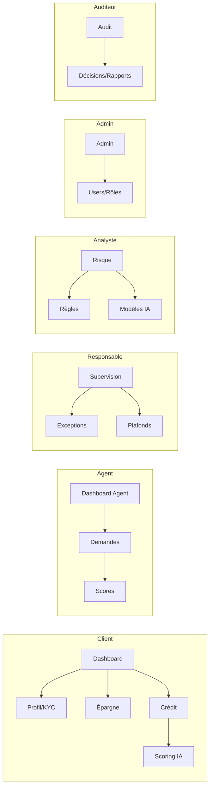

# Simbisa — Frontend Rawbank FinTech

Interface web de la plateforme **Simbisa**, solution de micro-crédit intelligente développée pour **Rawbank** (RDC). L'application permet à chaque acteur — client, agent, responsable, analyste, administrateur ou auditeur — d'accéder à un espace dédié à son rôle, avec une navigation et des écrans strictement filtrés.

Le code source React se trouve dans le sous-dossier [`web/`](web/).

---

## Stack technique

| Technologie | Rôle |
|-------------|------|
| **React 18** | Interface utilisateur |
| **Vite 5** | Build tool & dev server |
| **React Router v6** | Routing et navigation |
| **Tailwind CSS 3** | Utilitaires CSS (grille, couleurs, responsive) |
| **CSS custom** | Neumorphisme (ombres, reliefs, glow or) |
| **Recharts** | Graphiques (épargne, indicateurs) |
| **Lucide React** | Icônes |
| **clsx** | Composition de classes CSS |

---

## Démarrage rapide

```bash
cd web
npm install
npm run dev
```

L'application est accessible sur **http://localhost:5173**.

| Commande | Description |
|----------|-------------|
| `npm run dev` | Serveur de développement |
| `npm run build` | Build de production |
| `npm run preview` | Prévisualisation du build |

---

## Architecture — Atomic Design

Le projet suit une architecture **Atomic Design** stricte, du composant le plus simple à la page complète :

```
web/src/
├── components/
│   ├── atoms/        → Button, Input, Badge, Avatar, ScoreRing, Logo
│   ├── molecules/    → FormField, StatCard, NavItem, ScoreMotorCard…
│   ├── organisms/    → Sidebar, TopBar, ScoringPanel, SavingsWidget…
│   └── templates/    → AuthLayout, DashboardLayout
├── pages/            → Écrans par rôle (Login, Dashboard, Agent…)
├── context/          → AuthContext (session, rôle)
├── constants/        → Rôles, navigation, permissions
├── hooks/            → useScore
├── utils/            → formatters
└── styles/           → theme.css, neumorphism.css
```

| Niveau | Responsabilité | Exemples |
|--------|----------------|----------|
| **Atoms** | Briques UI indivisibles | `Button`, `Input`, `Badge` |
| **Molecules** | Combinaison d'atomes | `StatCard`, `FormField`, `NavItem` |
| **Organisms** | Sections fonctionnelles | `Sidebar`, `CreditRequestForm` |
| **Templates** | Mise en page sans contenu métier | `DashboardLayout`, `AuthLayout` |
| **Pages** | Écrans routés avec données | `Dashboard`, `AgentRequests` |

---

## Style visuel — Neumorphisme & identité Rawbank

### Palette

| Token | Couleur | Usage |
|-------|---------|-------|
| `noir` | `#0A0A0A` | Fond profond |
| `surface` | `#141414` | Arrière-plan principal |
| `panel` | `#1A1A1A` | Cartes et panneaux |
| `or` / `or-light` | `#D4AF37` / `#F0C040` | Accent Rawbank, CTA, score |
| `blanc` | `#F5F5F5` | Texte principal |
| `muted` | `#9CA3AF` | Texte secondaire |
| `success` / `warning` / `danger` | Vert / Ambre / Rouge | Statuts, badges |

### Neumorphisme

Les composants utilisent des **ombres doubles** (claire + sombre) pour simuler un relief sur fond sombre :

- `.neu-flat` — Carte en relief sortant
- `.neu-inset` — Zone enfoncée (inputs, barres de progression)
- `.neu-sm` — Relief léger
- `.neu-pressed` — État actif / enfoncé
- `.neu-gold-glow` — Halo doré (logo, éléments premium)

### Typographie

- **Inter** — Corps de texte, labels, formulaires
- **Sora** — Titres, chiffres clés, wordmark Simbisa
- `.text-gradient-gold` — Dégradé or sur le logo et les montants importants

### Principes UI

- Mode **sombre exclusif** — confort visuel, aspect premium FinTech
- **Coins arrondis** généreux (`rounded-xl2`, `rounded-xl3`)
- **Transitions** douces sur ombres et hover (`transition-neu`)
- **Badges colorés** par statut (KYC, risque, crédit)
- **ScoreRing** SVG animé avec glow selon le niveau de risque

---

## Authentification & contrôle d'accès (RBAC)

Chaque utilisateur possède un **rôle unique** qui détermine :

1. La **sidebar** affichée (items de navigation)
2. Les **routes accessibles** (`ProtectedRoute`)
3. La **page d'accueil** après connexion

La session est gérée par `AuthContext` (persistée en `localStorage`).

### Connexion démo

Sur `/login`, des boutons permettent de se connecter instantanément avec chaque rôle. Comptes téléphone : `+243800000001` à `+243800000006` · mot de passe : `1234`.

| Rôle | Accueil après login |
|------|---------------------|
| Client | `/dashboard` |
| Agent de crédit | `/agent` |
| Responsable crédit | `/manager` |
| Analyste risque | `/risk` |
| Administrateur | `/admin` |
| Auditeur | `/audit` |

---

## Rôles & pages

### Client

Personne non bancarisée souhaitant accéder aux services financiers Simbisa.

| Route | Page | Fonctionnalité |
|-------|------|----------------|
| `/dashboard` | Tableau de bord | Vue d'ensemble : score, épargne, crédits récents, prochain remboursement |
| `/profile` | Mon profil & KYC | Modifier le profil, soumettre une pièce d'identité |
| `/savings` | Épargne virtuelle | Consulter le solde, déposer/retirer, objectif d'épargne, impact scoring |
| `/credit-request` | Demande de crédit | Formulaire montant/durée/motif, scoring live, décision IA |
| `/my-credits` | Mes crédits | Historique et statut de tous les crédits |
| `/repayments` | Remboursements | Payer une échéance via illicocash |
| `/scoring` | Mon score | Scoring multi-moteur + attributions SHAP |
| `/ai-explanations` | Explications IA | Mémo RAG, bannière de décision, panneau XAI |
| `/register` | Inscription | Création de compte client (public) |

---

### Agent de crédit

Employé chargé du traitement opérationnel des dossiers.

| Route | Page | Fonctionnalité |
|-------|------|----------------|
| `/agent` | Tableau de bord agent | KPIs, dossiers prioritaires, mémo IA |
| `/agent/requests` | Demandes de crédit | Liste des demandes, valider/rejeter, ajouter des observations |
| `/scoring` | Scores clients | Détail scoring multi-moteur et SHAP |

---

### Responsable crédit

Responsable hiérarchique — supervision et décisions sensibles.

| Route | Page | Fonctionnalité |
|-------|------|----------------|
| `/manager` | Supervision | Dossiers sensibles, KPIs, approbations de niveau supérieur |
| `/agent/requests` | Dossiers en attente | Même vue agent pour instruire les demandes |
| `/manager/exceptions` | Exceptions | Gérer les dérogations (plafond, ancienneté, KYC…) |
| `/manager/plafonds` | Plafonds | Modifier les montants min/max et seuils d'approbation |
| `/scoring` | Scores | Consultation du scoring détaillé |

---

### Analyste risque

Spécialiste de la gestion du risque et des modèles IA.

| Route | Page | Fonctionnalité |
|-------|------|----------------|
| `/risk` | Tableau de bord risque | Taux de défaut, AUC, alertes, indicateurs PD |
| `/risk/rules` | Règles métier | Activer/désactiver les règles éliminatoires du moteur « Règles » |
| `/risk/models` | Performance modèles | Métriques XGBoost/LightGBM (AUC, Gini, Brier) |
| `/scoring` | Scoring détaillé | Analyse XAI complète (SHAP, LIME, moteurs) |

---

### Administrateur système

Gestion technique de la plateforme.

| Route | Page | Fonctionnalité |
|-------|------|----------------|
| `/admin` | Administration | Vue d'ensemble : utilisateurs, sessions, alertes sécurité |
| `/admin/users` | Utilisateurs | CRUD utilisateurs, statuts (actif/bloqué) |
| `/admin/roles` | Rôles | Matrice RBAC, effectifs par rôle |
| `/admin/settings` | Paramètres | MFA obligatoire, timeout session, mode maintenance |

---

### Auditeur

Contrôle interne et conformité.

| Route | Page | Fonctionnalité |
|-------|------|----------------|
| `/audit` | Audit | KPIs audit, accès rapides aux contrôles |
| `/audit/decisions` | Décisions | Vérifier les décisions de crédit (auto vs manuelle) |
| `/audit/reports` | Rapports | Générer et télécharger des rapports d'audit PDF |

---

## Schéma de navigation par rôle



---

## Intégration backend

Le frontend est conçu pour consommer l'API Django REST (`backend/`) :

| Variable | Valeur par défaut |
|----------|-------------------|
| API base URL | `http://localhost:8000/api/v1/` |
| Auth | JWT Bearer (`Authorization: header`) |
| CORS | `http://localhost:5173` autorisé côté backend |

En mode démo actuel, l'authentification est **simulée côté client** (`AuthContext` + comptes `DEMO_USERS`). Le branchement API se fera en remplaçant les appels mock dans `AuthContext` par les endpoints `/auth/login`, `/auth/register`, etc.

---

## Structure des fichiers clés

| Fichier | Rôle |
|---------|------|
| `src/App.jsx` | Définition de toutes les routes protégées par rôle |
| `src/context/AuthContext.jsx` | Session utilisateur, login/logout |
| `src/constants/roles.js` | Rôles, permissions routes, comptes démo |
| `src/constants/navigation.js` | Items sidebar par rôle |
| `src/components/guards/ProtectedRoute.jsx` | Garde d'accès RBAC |
| `src/styles/theme.css` | Variables, Tailwind, classes neumorphiques |
| `tailwind.config.js` | Tokens couleurs, ombres, polices |

---

## Licence

Propriété **Rawbank** — Simbisa FinTech Platform. Usage interne.
