# TFC Simbisa — Corrections textuelles + Diagrammes PlantUML

---

## PARTIE 1 : CORRECTIONS TEXTUELLES

### Corrections factuelles (erreurs vs le projet réel)

---

**Section 3.2.6 — Besoins techniques et outils**

REMPLACER le bloc actuel par :

> Backend : API REST exposant les services d'authentification, de gestion des utilisateurs et des clients, de scoring, de sessions USSD et de reporting. Implémentée avec Django REST Framework (Python), l'API orchestre l'ensemble des appels entre les modules applicatifs.
> Tâches asynchrones : les calculs de scoring et la génération de rapports RAG s'exécutent hors du cycle requête/réponse via Celery, avec Redis comme broker de messages.
> Persistance : MySQL pour les données structurées (utilisateurs, crédits, épargne, journaux) et Redis pour le cache et les sessions USSD.
> Data Science / Machine Learning : pipeline de features, apprentissage XGBoost, sérialisation du modèle et endpoints de scoring (Python, scikit-learn, XGBoost).
> Intelligence artificielle explicable : génération d'explications locales et globales via SHAP et LIME, avec stockage des vecteurs d'attribution dans MySQL pour l'audit.
> Génération augmentée par récupération : indexation vectorielle dans pgvector (PostgreSQL), calcul d'embeddings et génération de texte via l'API Gemini de Google DeepMind (modèle gemini-2.0-flash, embeddings text-embedding-004).
> Interface : tableau de bord web (React + Vite) pour les agents, administrateurs et auditeurs ; application mobile (Flutter) pour les clients, accessible sur Android et iOS.

---

**Section 3.3.1 — Diagramme de déploiement (légende)**

REMPLACER la description actuelle par :

> Le prototype est conteneurisé via Docker Compose. Les conteneurs applicatifs sont : l'API Django (port 8000), le worker Celery pour le scoring asynchrone, et le scheduler Celery Beat pour les tâches planifiées. Les services de données sont : MySQL (port 3306) pour la persistance relationnelle, Redis (port 6379) comme broker de messages et cache de sessions USSD, et PostgreSQL + pgvector pour l'index vectoriel RAG. Le frontend React est déployé sur Vercel (CDN externe) ; l'application Flutter est distribuée via les stores (hors périmètre POC). En production, Nginx sur l'hôte sert de reverse proxy vers le port 8000 de l'API.

---

### Corrections humanize-writing

---

**Section 0.1 — dernier paragraphe**

AVANT :
> Le choix de ce sujet se justifie d'abord par sa pertinence socio-économique immédiate : en ancrant le scoring de crédit sur des données réellement disponibles pour les populations non bancarisées, ce travail répond directement à un besoin documenté de l'écosystème financier congolais [20, 22, 1]. Sur le plan académique, il se situe à la convergence de trois domaines de recherche habituellement traités séparément dans la littérature : la modélisation statistique et computationnelle du risque de crédit, l'intelligence artificielle explicable appliquée à la finance, et l'ingénierie logicielle distribuée appliquée aux contraintes des réseaux télécom africains (USSD, connectivité intermittente). L'originalité du travail réside dans l'intégration native de ces trois axes au sein d'une architecture logicielle unique et auditable, plutôt que dans le traitement isolé de l'un d'entre eux.

APRÈS :
> Ce choix se justifie d'abord par sa pertinence socio-économique : en fondant le scoring de crédit sur des données effectivement disponibles pour les populations non bancarisées, ce travail adresse un besoin documenté de l'écosystème financier congolais [20, 22, 1]. Sur le plan académique, il croise trois domaines habituellement traités séparément : la modélisation statistique du risque de crédit, l'IA explicable appliquée à la finance, et l'ingénierie logicielle distribuée adaptée aux contraintes des réseaux télécom africains — USSD, connectivité intermittente. L'originalité tient à l'intégration de ces trois axes dans une même architecture auditable, plutôt qu'au traitement isolé de l'un d'entre eux.

---

**Section 2.1 — première phrase**

AVANT :
> La conception d'un système d'information part rarement d'une page blanche : elle s'appuie sur ce qui existe déjà, ses forces et ses limites, avant de proposer une trajectoire d'amélioration.

APRÈS :
> La conception d'un système d'information s'appuie toujours sur ce qui existe déjà : comprendre les forces et les limites du système en place est la condition pour proposer quelque chose de mieux fondé.

---

**Section 3.2.7.4 — première phrase**

AVANT :
> Dans un système de scoring de crédit, la performance prédictive seule ne suffit pas : il est nécessaire d'expliquer chaque décision afin de renforcer la confiance, faciliter l'audit et permettre une prise de décision responsable, conformément au cadre théorique exposé au point 1.2.3 [31, 24, 33].

APRÈS :
> Dans un système de scoring de crédit, la performance prédictive ne suffit pas. Chaque décision doit pouvoir être expliquée — pour l'agent de crédit qui statue sur le dossier, pour l'auditeur qui vérifie la conformité, et pour le client qui conteste un refus — conformément au cadre théorique du point 1.2.3 [31, 24, 33].

---

**Section 3.4 — premier paragraphe**

AVANT :
> Ce travail se situe au stade de la conception et de la modélisation d'un prototype (cf. délimitation, point 0.7) : les indicateurs quantitatifs associés aux trois hypothèses (aire sous la courbe ROC, cohérence d'explication SHAP/LIME, taux d'hallucination du pipeline RAG) restent à mesurer sur un jeu de données constitué.

APRÈS :
> Ce travail porte sur la conception et la modélisation d'un prototype (point 0.7) : les indicateurs des trois hypothèses — aire sous la courbe ROC, cohérence d'explication SHAP/LIME, taux d'hallucination du pipeline RAG — restent à mesurer sur un jeu de données constitué.

---

**Conclusion — avant-dernier paragraphe**

AVANT :
> Ce travail montre enfin qu'un projet de Génie Logiciel peut articuler gestion de projet agile, modélisation par le Processus Unifié et intégration de composants d'intelligence artificielle explicable et générative au sein d'une même architecture, auditable et conforme aux exigences du secteur bancaire congolais — sans que l'un de ces registres prenne le pas sur les deux autres.

APRÈS :
> Ce travail illustre aussi qu'une architecture de Génie Logiciel peut faire coexister gestion de projet agile, modélisation par le Processus Unifié et composants d'intelligence artificielle explicable et générative, sans que l'un de ces registres n'efface les deux autres — chaque couche reste lisible et auditable indépendamment.

---

---

## PARTIE 2 : DIAGRAMMES PLANTUML

Chaque bloc PlantUML correspond à la figure indiquée dans le document.
Rendu recommandé : PlantUML server (plantuml.com/plantuml) ou extension VS Code.

---

### Figure 1 — Diagramme de Gantt

```plantuml
@startgantt
title Planification prévisionnelle du projet Simbisa (8 semaines / 46 jours ouvrés)
printscale daily zoom 2
saturday are closed
sunday are closed

Project starts 2025-09-01

-- PHASE 1 : Inception (S1-S2) --
[Cadrage & état de l'art] lasts 5 days and starts 2025-09-01
[Analyse de l'existant illicocash] lasts 4 days and starts 2025-09-01
[Diagramme de contexte] lasts 2 days and starts after [Analyse de l'existant illicocash]
[Diagramme de cas d'utilisation global] lasts 3 days and starts after [Diagramme de contexte]
[Étude de faisabilité & Gantt] lasts 2 days and starts after [Cadrage & état de l'art]
[JALON 1 — Inception] happens at [Diagramme de cas d'utilisation global]'s end

-- PHASE 2 : Élaboration (S3-S4) --
[Fiches cas d'utilisation détaillées] lasts 3 days and starts at [JALON 1 — Inception]'s start
[Diagrammes de séquence (Auth, Score, Décaissement)] lasts 5 days and starts after [Fiches cas d'utilisation détaillées]
[Diagrammes de collaboration] lasts 3 days and starts after [Fiches cas d'utilisation détaillées]
[Matrice RBAC & exigences] lasts 2 days and starts after [Fiches cas d'utilisation détaillées]
[JALON 2 — Élaboration] happens at [Diagrammes de séquence (Auth, Score, Décaissement)]'s end

-- PHASE 3 : Construction (S5-S7) --
[Diagramme de classes & objets] lasts 4 days and starts at [JALON 2 — Élaboration]'s start
[Diagramme d'activités (pipeline crédit)] lasts 3 days and starts at [JALON 2 — Élaboration]'s start
[Diagramme de composants] lasts 3 days and starts after [Diagramme de classes & objets]
[Diagramme états-transitions] lasts 2 days and starts after [Diagramme d'activités (pipeline crédit)]
[Pipeline XGBoost + SHAP/LIME] lasts 6 days and starts at [JALON 2 — Élaboration]'s start
[Pipeline RAG (pgvector + Gemini)] lasts 5 days and starts after [Pipeline XGBoost + SHAP/LIME]
[JALON 3 — Construction] happens at [Pipeline RAG (pgvector + Gemini)]'s end

-- PHASE 4 : Transition (S8) --
[Diagramme de déploiement Docker] lasts 3 days and starts at [JALON 3 — Construction]'s start
[Tests de scénarios critiques] lasts 4 days and starts after [Diagramme de déploiement Docker]
[Rédaction finale & relecture] lasts 5 days and starts at [JALON 3 — Construction]'s start
[JALON FINAL — Livraison J46] happens at [Tests de scénarios critiques]'s end

[Cadrage & état de l'art] is colored in DarkSalmon
[Diagrammes de séquence (Auth, Score, Décaissement)] is colored in DarkSalmon
[Pipeline XGBoost + SHAP/LIME] is colored in DarkSalmon
[Pipeline RAG (pgvector + Gemini)] is colored in DarkSalmon
[Tests de scénarios critiques] is colored in DarkSalmon
@endgantt
```

---

### Figure 2 — Diagramme de contexte

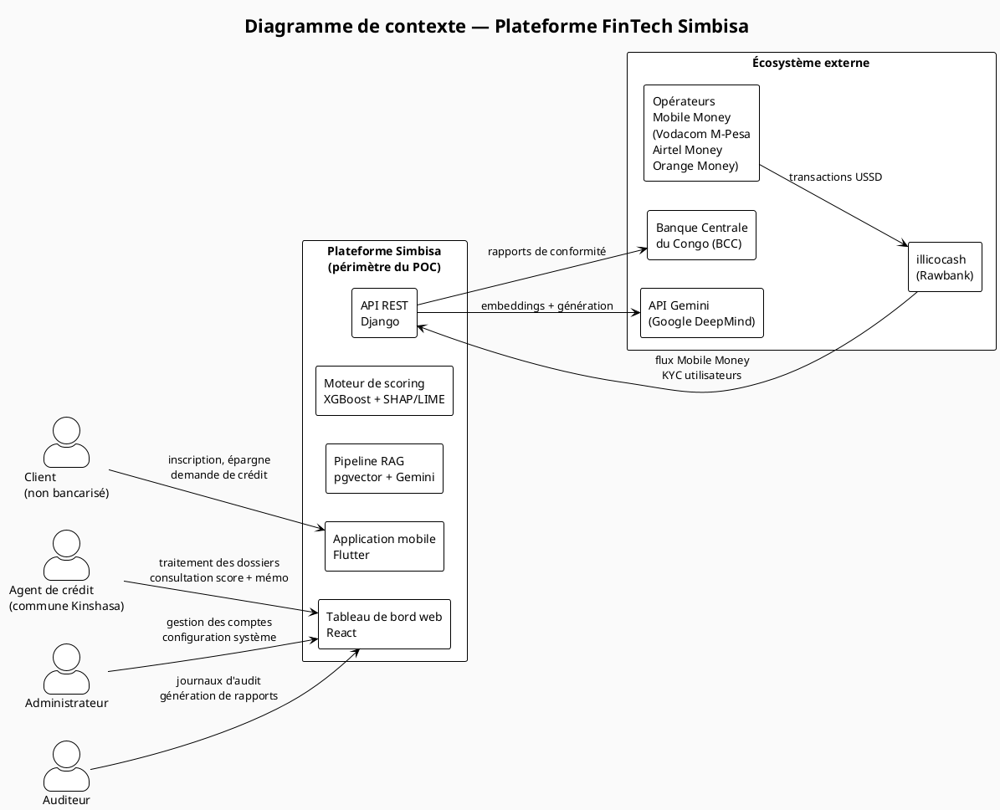

---

### Figure 3 — Diagramme de cas d'utilisation (vue globale)

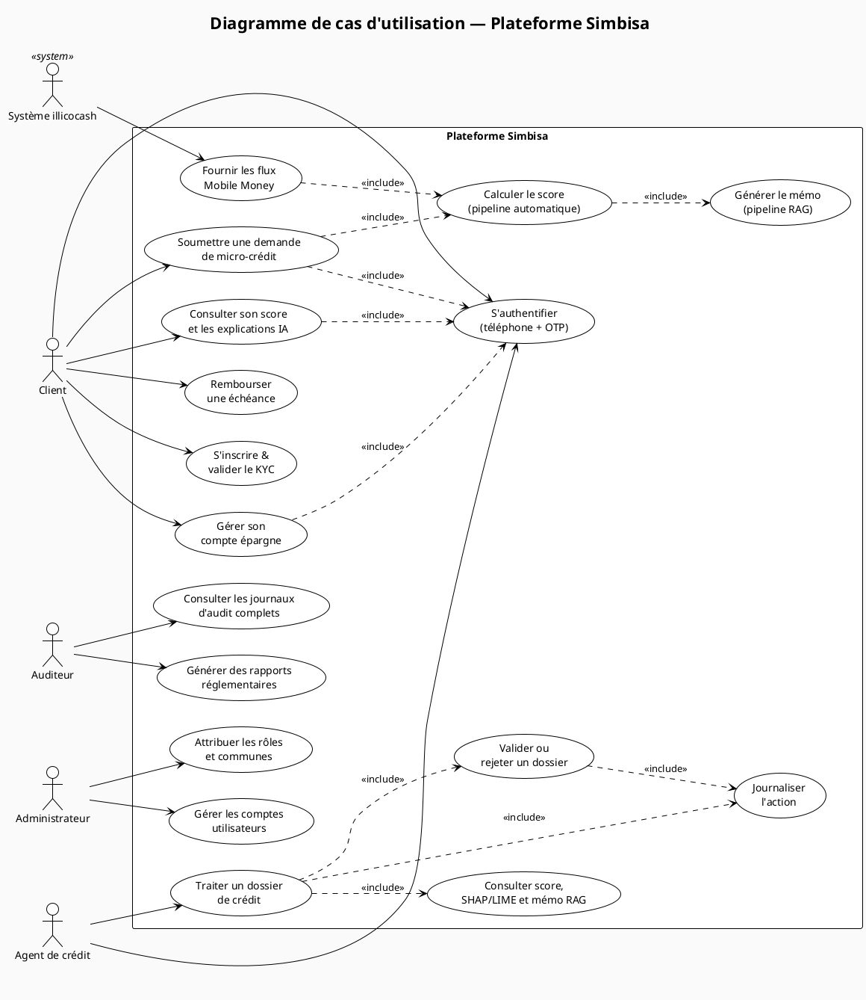

---

### Figure 4 — Diagramme de séquence — Authentification (téléphone + OTP)

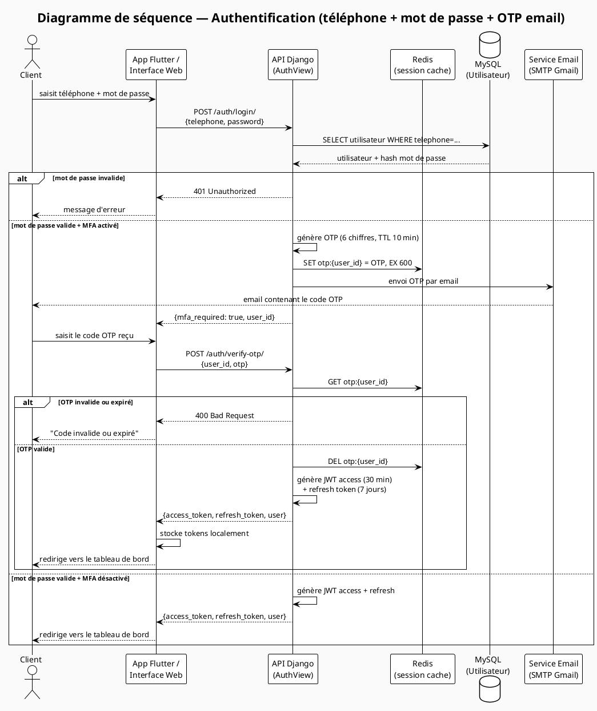

---

### Figure 5 — Diagramme de séquence — Calcul du score de crédit

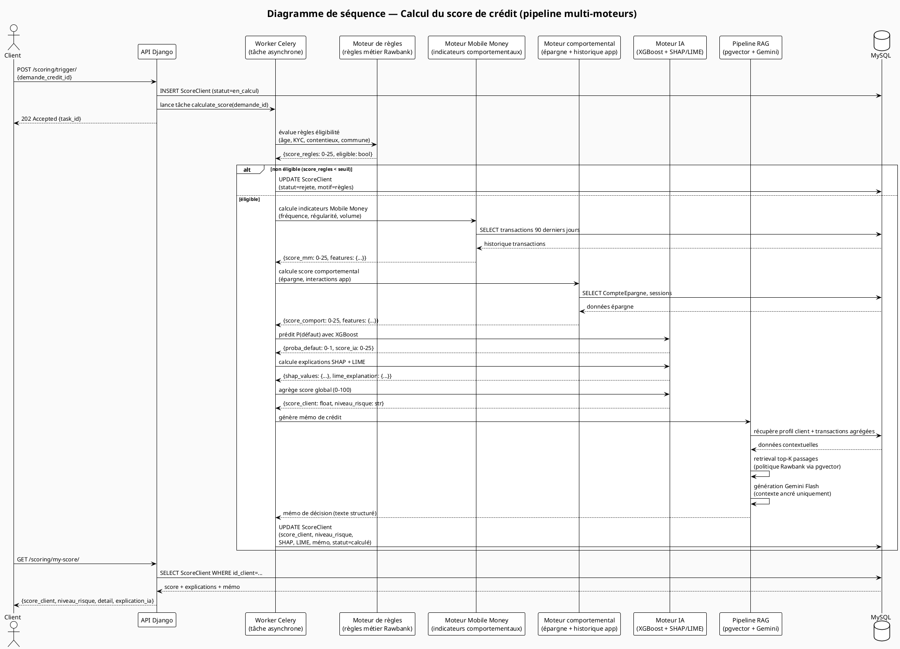

---

### Figure 6 — Diagramme de séquence — Décaissement automatique

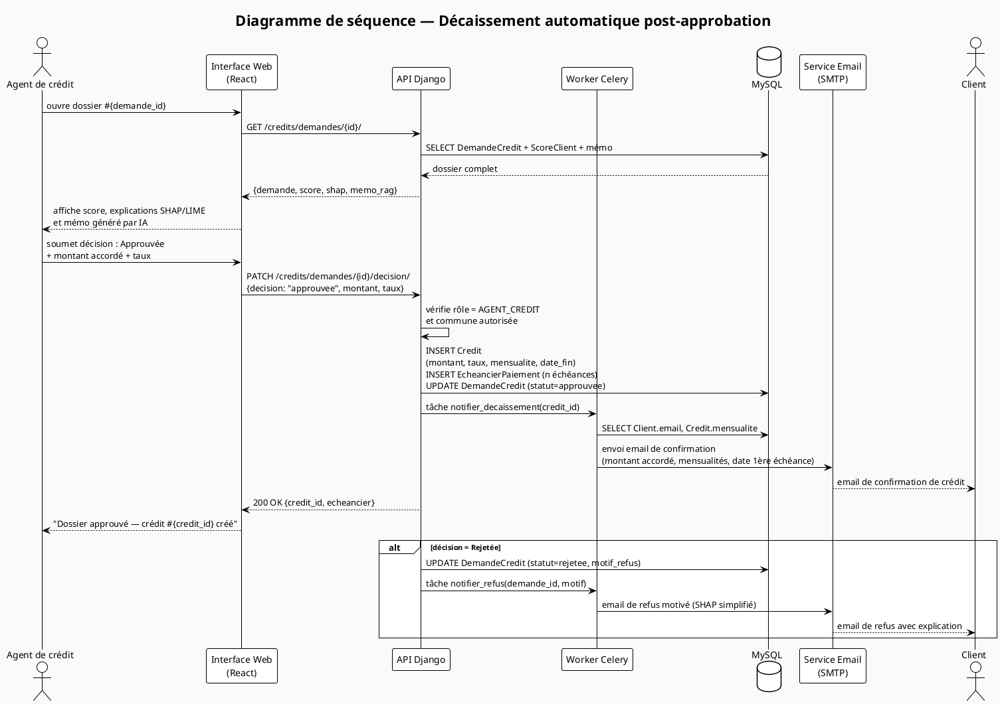

---

### Figure 7 — Diagramme de communication — Authentification

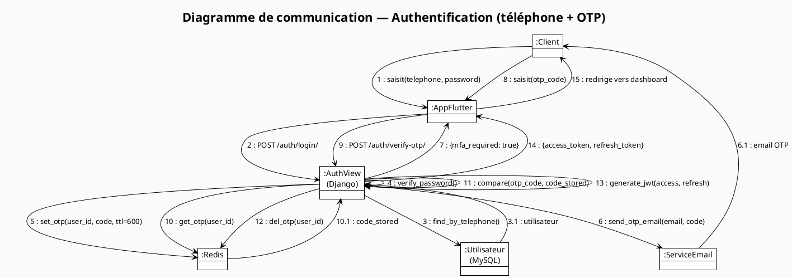

---

### Figure 8 — Diagramme de communication — Calcul du score

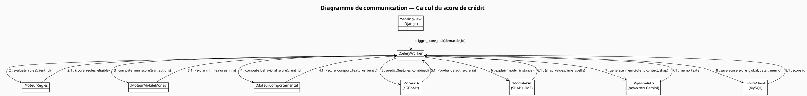

---

### Figure 9 — Diagramme de classes

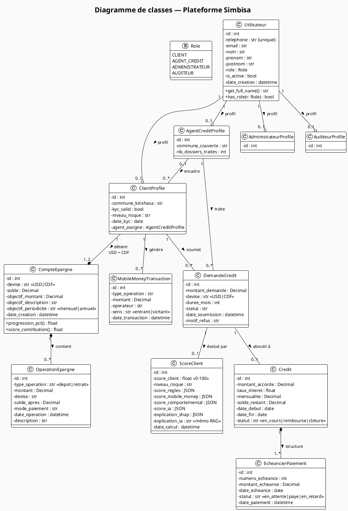

---

### Figure 10 — Diagramme d'objets — dossier approuvé

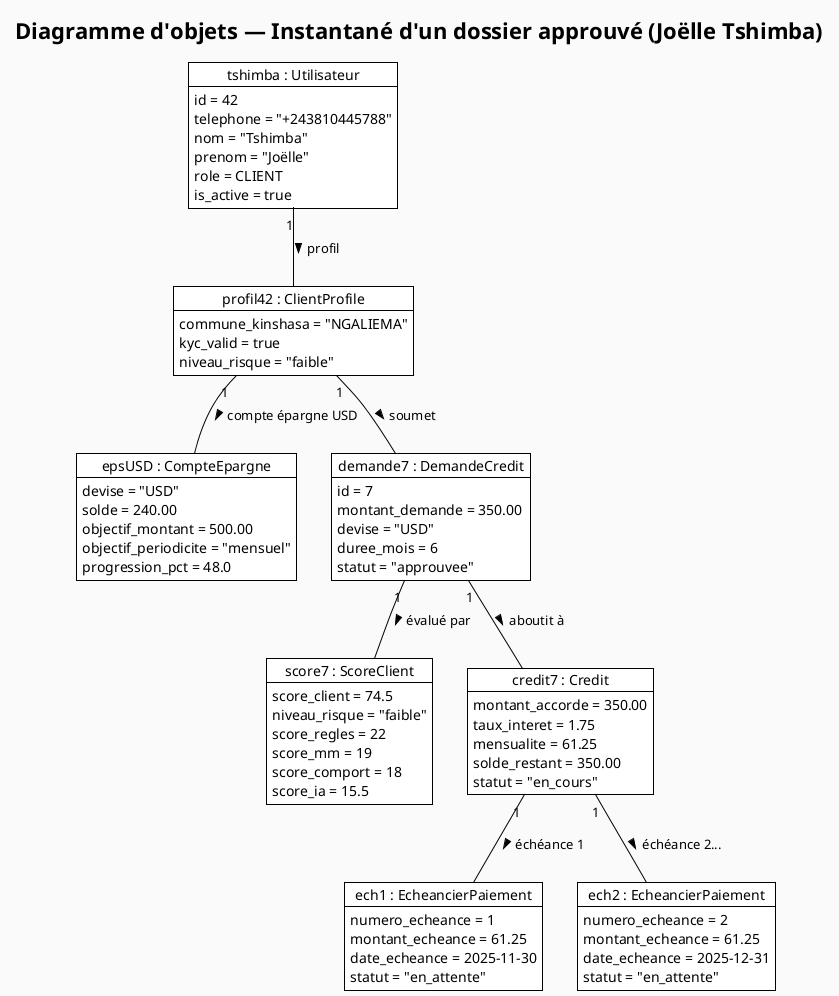

---

### Figure 11 — Diagramme d'activités — pipeline d'évaluation décisionnelle

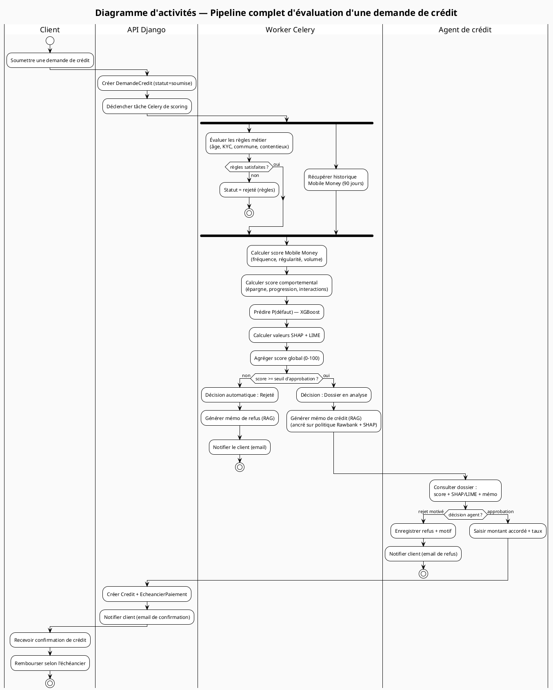

---

### Figure 12 — Diagramme de composants

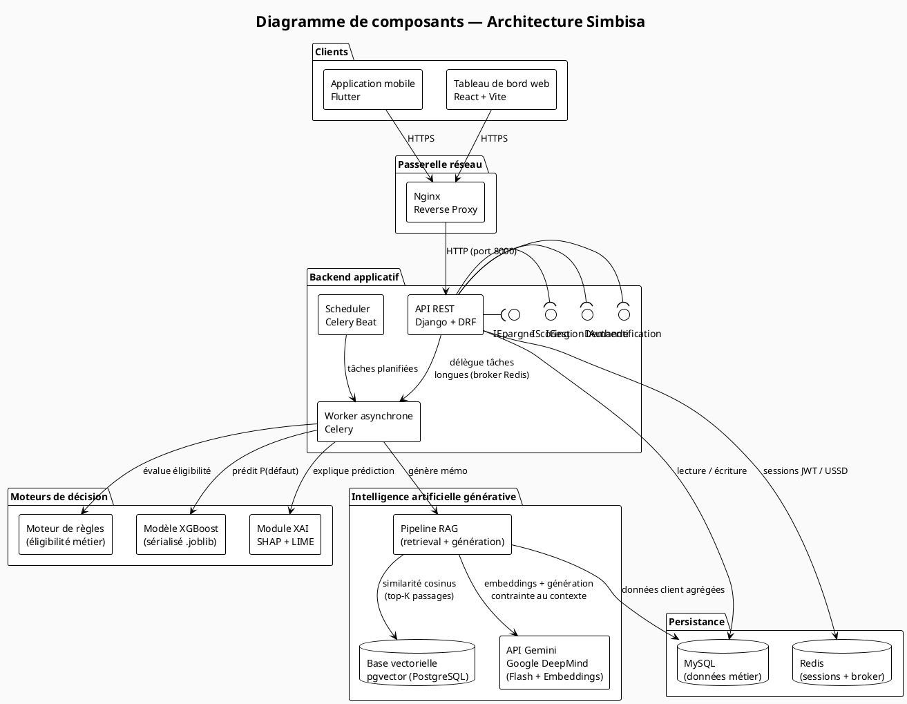

---

### Figure 13 — Diagramme d'états-transitions — cycle de vie d'une demande de crédit

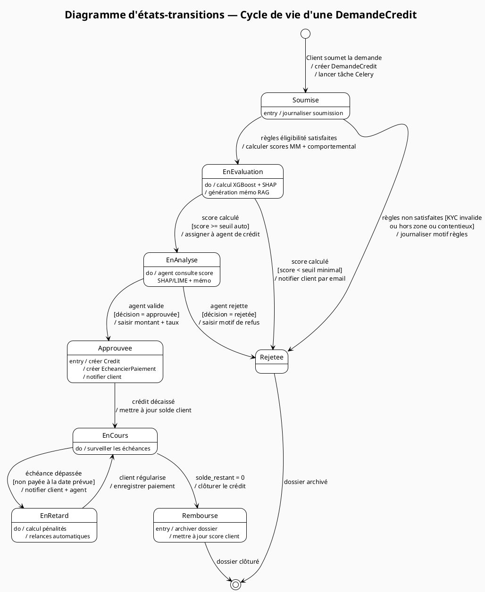

---

### Figure 14 — Diagramme de déploiement

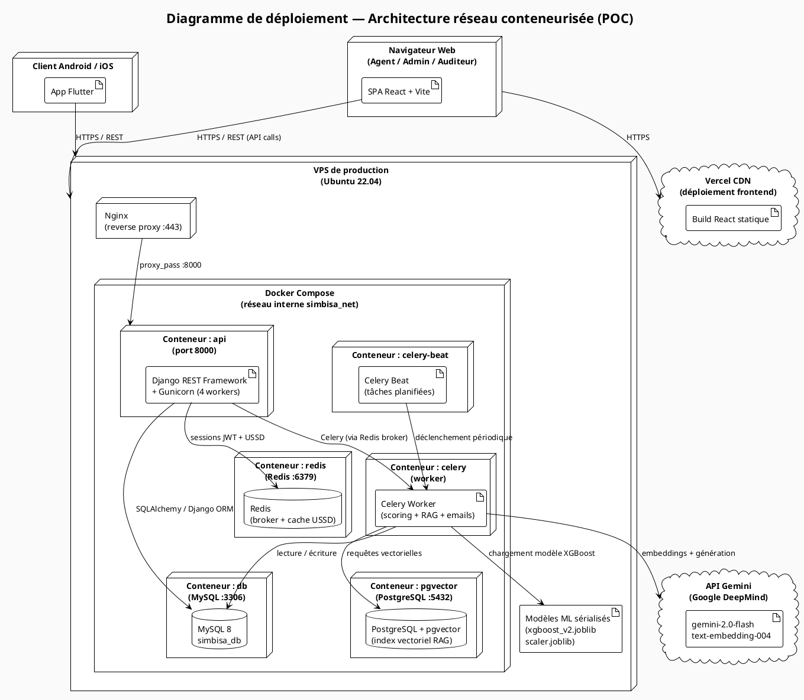

---

### NOUVEAU — Figure 1.2.4 — Architecture RAG : de l'indexation à la génération de mémos

Ce diagramme est à insérer dans la section 1.2.4, après le paragraphe décrivant les trois modules du RAG.

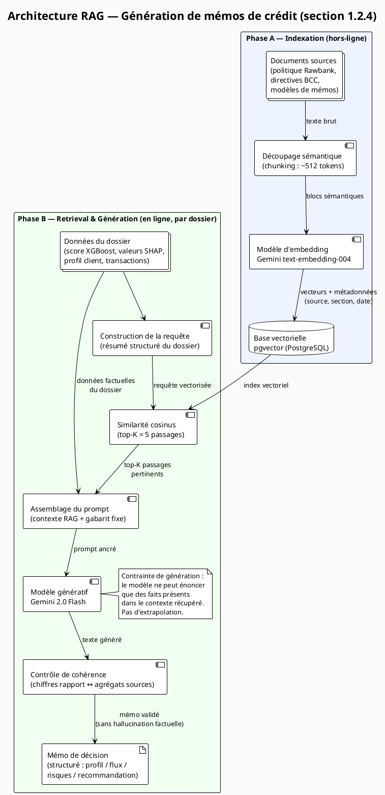

---

## RÉCAPITULATIF DES CORRECTIONS

| # | Localisation | Type | Description |
|---|---|---|---|
| 1 | Section 3.2.6 | Factuel | "FastAPI" → "Django REST Framework" |
| 2 | Section 3.2.6 | Factuel | "LangChain" → "API Gemini (Google DeepMind)" |
| 3 | Section 3.2.6 | Factuel | Ajout Celery (worker asynchrone) |
| 4 | Section 3.2.6 | Factuel | Préciser Flutter (mobile) + React (web) |
| 5 | Section 3.3.1 | Factuel | Diagramme déploiement : ajouter Celery + conteneur pgvector |
| 6 | Section 0.1 | Humanize | Triplet artificiel → reformulation ciblée |
| 7 | Section 2.1 | Humanize | "trajectoire d'amélioration" → formulation directe |
| 8 | Section 3.2.7.4 | Humanize | "il est nécessaire d'expliquer... afin de renforcer, faciliter et permettre" (triplet) |
| 9 | Section 3.4 | Humanize | Formule de mémoire redondante |
| 10 | Conclusion | Humanize | "Ce travail montre enfin" → "Ce travail illustre aussi" + restructuration |
| 11 | Section 1.2.4 | Nouveau | Ajout diagramme RAG (Phase A indexation + Phase B génération) |
| 12 | Toutes figures | Diagramme | 14 diagrammes PlantUML conformes au projet réel |
