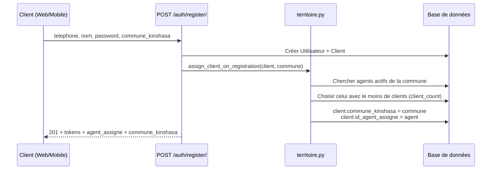
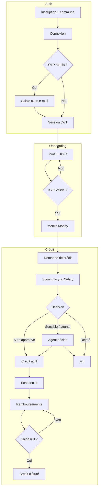
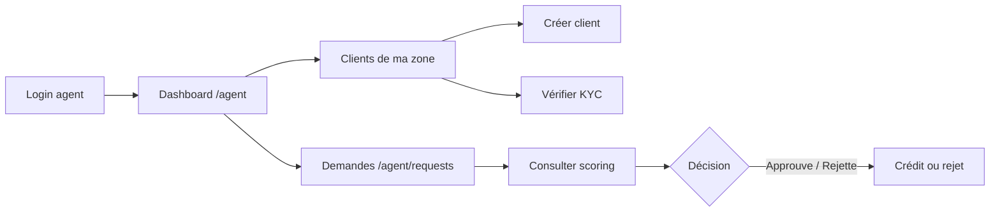
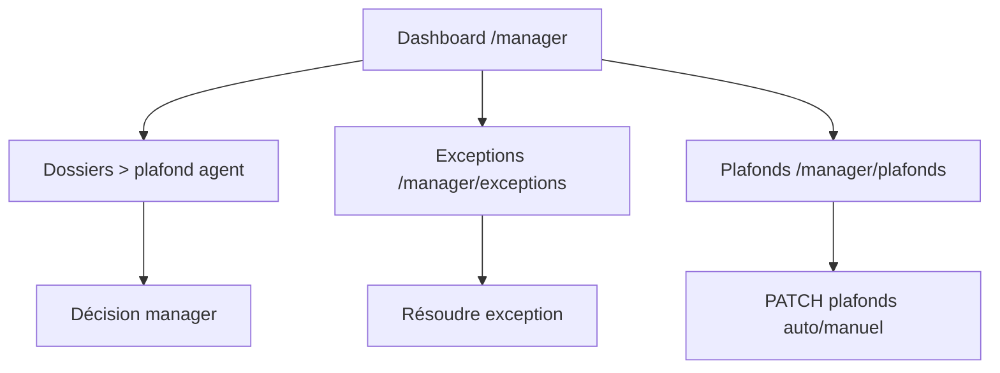
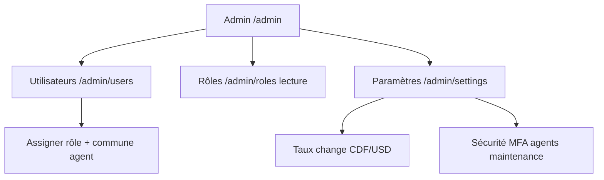

# Simbisa — Audit système, workflows et couverture frontend

Document de référence pour la plateforme de micro-crédit Rawbank (RDC).  
Dernière mise à jour : juin 2026.

---

## 1. Canaux par rôle

| Rôle | Web | Mobile | Remarque |
|------|-----|--------|----------|
| **Client** | ✅ Complet | ✅ Partiel | App Flutter `Frontend/Mobile` |
| **Agent de crédit** | ✅ Complet | 🔜 Prévu, non développé | Aujourd'hui : agent **uniquement sur Web** |
| Responsable crédit | ✅ | ❌ | Web exclusif |
| Analyste risque | ✅ | ❌ | Web exclusif |
| Administrateur | ✅ | ❌ | Web exclusif |
| Auditeur | ✅ | ❌ | Web exclusif |

**Hors scope frontend :** canal USSD (`Backend/apps/ussd/`) — API backend uniquement.

---

## 2. Attribution client → agent de crédit

### 2.1 Règle métier (backend)

Fichier : `Backend/apps/clients/services/territoire.py`

- Kinshasa est découpée en **24 communes** (`Backend/apps/core/kinshasa_communes.py`).
- Chaque **agent** a une commune assignée (champ `commune_kinshasa` sur `Utilisateur`).
- Chaque **client** a une commune et **un seul** agent référent (`Client.id_agent_assigne`).
- Un agent ne voit que **ses** clients et **leurs** demandes de crédit.
- Plusieurs agents peuvent couvrir la même commune ; à l'inscription, le client est affecté à l'agent **le moins chargé** de cette commune.

### 2.2 Où la commune est saisie

La commune **est bien demandée à l'inscription** — sur Web et Mobile :

| Canal | Écran | Champ | API |
|-------|-------|-------|-----|
| Web | `/register` | Select « Commune de résidence (Kinshasa) » | `commune_kinshasa` dans `POST /api/v1/auth/register/` |
| Mobile | `RegisterScreen` | Dropdown communes (chargées via API) | Idem |

Texte d'aide Web : *« Vous serez orienté vers l'agent de crédit de votre zone. »*

Le backend **exige** `commune_kinshasa` (`RegisterSerializer`, champ obligatoire).

### 2.3 Workflow d'attribution à l'inscription en ligne



**Code clé :**

- `Backend/apps/authentication/views.py` → `register_view` appelle `assign_client_on_registration`
- `pick_agent_for_inscription(commune)` → agent actif, rôle « Agent de crédit », même commune, tri par nombre de clients

**Réponse API (extrait) :**

```json
{
  "data": {
    "agent_assigne": { "id": 2, "full_name": "...", "telephone": "+243..." },
    "commune_kinshasa": "gombe"
  }
}
```

> **Manque frontend :** ni Web ni Mobile n'affichent l'agent assigné après inscription (`agent_assigne` est ignoré côté UI).

### 2.4 Autres modes d'attribution

```mermaid
flowchart TD
    A[Nouveau client] --> B{Mode de création}
    B -->|Inscription en ligne| C[Client choisit sa commune]
    C --> D[Auto : agent le moins chargé de la commune]
    B -->|Création par agent| E[Agent crée le client]
    E --> F[Commune = commune de l'agent]
    F --> G[assign_client_to_agent → agent créateur]
    B -->|Compte agent| H[Admin assigne commune à l'agent]
    H --> I[PATCH /admin/users/{id}/ commune_kinshasa]
```

| Scénario | Qui définit la commune | Qui définit l'agent | Endpoint / écran |
|----------|------------------------|---------------------|------------------|
| Inscription client | Le client (register) | Automatique (moins chargé) | `POST /auth/register/` — Web `/register`, Mobile register |
| Création par agent | Héritée de l'agent | L'agent créateur | `POST /clients/create/` — Web `/agent/clients` |
| Compte agent | **Administrateur** | N/A (l'agent *est* le référent) | Web `/admin/users` → PATCH commune pour rôle « Agent de crédit » |
| Réaffectation manuelle | — | **Non exposé** | Pas d'endpoint UI pour changer `id_agent_assigne` après coup |

### 2.5 Filtrage côté agent

Quand un agent consulte ses clients ou demandes :

- `filter_clients_queryset` → `id_agent_assigne = agent`
- `filter_demandes_queryset` → `id_client__id_agent_assigne = agent`

Managers, admins, auditeurs et analystes voient **tout** (pas de filtre territoire).

### 2.6 Cas limites

| Situation | Comportement |
|-----------|--------------|
| Aucun agent actif dans la commune | `id_agent_assigne = null` — client créé mais non rattaché |
| Agent sans commune (admin oubli) | Création client par agent **bloquée** avec message d'erreur |
| Client change de commune | Non géré en self-service — `commune_kinshasa` client en lecture seule via API profil |

---

## 3. Workflow global — Client



### Détail par étape — Client

| # | Opération | API | Web | Mobile client | Statut |
|---|-----------|-----|-----|---------------|--------|
| 1 | Inscription (+ commune) | `POST /auth/register/` | `/register` ✅ | Register ✅ | Commune OK ; agent assigné non affiché |
| 2 | Connexion | `POST /auth/login/` | `/login` ✅ OTP | Login ⚠️ | Mobile : pas d'écran OTP |
| 3 | Mot de passe oublié | `password/forgot` → `verify-otp` → `reset` | `/forgot-password` ✅ | ❌ | **À faire mobile** |
| 4 | Session / refresh JWT | `token/refresh`, `auth/me` | ✅ | ✅ `restoreSession` | OK |
| 5 | Profil | `GET/PATCH /clients/me/` | `/profile` ✅ | Profil ⚠️ lecture | **Mobile : édition profil** |
| 6 | KYC (upload pièce) | `POST /clients/me/identite/` | `/profile` ✅ | ❌ | **Mobile : upload KYC** |
| 7 | MFA e-mail | `mfa/setup`, `mfa/verify` | `/profile` ✅ | ❌ | **Mobile : MFA** |
| 8 | Changement MDP | `POST /auth/change-password/` | `/profile` ✅ | ❌ | **Mobile** |
| 9 | Mobile Money | `GET/POST /wallets/mobile-money/` | `/wallets` ✅ | Profil (lecture) ⚠️ | **Mobile : écran + ajout compte** |
| 10 | Épargne | savings, dépôt, retrait, historique | `/savings` ✅ | Onglet Épargne ✅ | OK |
| 11 | Demande crédit | `POST /credits/` + poll scoring | `/credit-request` ✅ | Onglet Crédit ✅ | OK |
| 12 | Mon score / XAI | `GET /scoring/me/` | `/scoring`, `/ai-explanations` ✅ | Onglet Scoring ✅ | OK |
| 13 | Mes crédits | `GET /credits/me/` | `/my-credits` ✅ | Via dashboard ✅ | Pas dans nav mobile |
| 14 | Échéancier | `GET /credits/{id}/echeances/` | `/echeancier` ✅ | `EcheancierScreen` ✅ | Route `/echeancier` absente du router |
| 15 | Remboursement | `POST /credits/{id}/remboursement/` | `/repayments` ✅ | Raccourci dashboard ✅ | **Mobile : page dédiée** |
| 16 | Explications IA | scoring + RAG optionnel | `/ai-explanations` ✅ | ❌ | **Mobile** |
| 17 | Dashboard | agrégation multi-API | `/dashboard` ✅ | Onglet Accueil ✅ | OK |

### Cycle de vie d'une demande de crédit (backend)

```
POST /credits/
  └─ Prérequis : KYC validé, pas de crédit actif (même devise), âge OK, montant dans plage

Demande → statut "en_analyse"
  └─ Celery : process_credit_scoring(demande_id)

ScoringOrchestrator (4 moteurs)
  ├─ Règles métier
  ├─ Mobile Money
  ├─ Comportemental
  └─ IA XGBoost + SHAP

Agrégateur → décision
  ├─ "approuve" (auto si score + montant ≤ plafond agent)
  ├─ "mise_en_attente" (dossier sensible)
  └─ "rejete"

Si approuvé → Credit + Echeances générées
```

| Statut demande | Signification | Où l'afficher |
|----------------|---------------|---------------|
| `en_analyse` | Scoring en cours | CreditRequest, MyCredits |
| `approuve` | Crédit débloqué | MyCredits, Dashboard |
| `rejete` | Refusé | Bannière décision, Scoring |
| `mise_en_attente` | Attente agent | AgentRequests (Web) |

---

## 4. Workflow — Agent de crédit

> **Canal cible :** Web aujourd'hui ; **app mobile agent prévue** mais pas encore développée.



| Opération | API | Web agent | Mobile agent |
|-----------|-----|-----------|--------------|
| Dashboard stats | `GET /credits/demandes/stats/` | `/agent` ✅ | ❌ À développer |
| Dossiers sensibles | `GET /credits/demandes/sensibles/` | `/agent` ✅ | ❌ |
| Liste demandes | `GET /credits/demandes/` | `/agent/requests` ✅ | ❌ |
| Décision dossier | `POST /credits/demandes/{id}/decision/` | ✅ | ❌ |
| Clients de ma zone | `GET /clients/` (filtré) | `/agent/clients` ✅ | ❌ |
| Créer client | `POST /clients/create/` | ✅ | ❌ |
| Modifier client | `PATCH /clients/{id}/` | ✅ | ❌ |
| Valider KYC | `POST /clients/kyc/{id}/verify/` | ✅ | ❌ |
| Scoring détaillé | `GET /scoring/{demande_id}/` | `/scoring?demande_id=` ✅ | ❌ |
| Mémo IA | `POST /rag/memo/` | `AIMemoPanel` ✅ | ❌ |

L'agent ne voit que les clients dont `id_agent_assigne` pointe vers lui (voir §2).

---

## 5. Workflow — Responsable crédit (Web uniquement)



| Opération | API | Web |
|-----------|-----|-----|
| Supervision | `GET /manager/dashboard/` | `/manager` ✅ |
| Décision dossiers sensibles | `POST /credits/demandes/{id}/decision/` | `/manager` + `/agent/requests` ✅ |
| Exceptions | `GET/PATCH /manager/exceptions/` | `/manager/exceptions` ✅ |
| Plafonds USD/CDF | `GET/PATCH /manager/plafonds/` | `/manager/plafonds` ✅ |

---

## 6. Workflow — Analyste risque (Web uniquement)

| Opération | API | Web | Remarque |
|-----------|-----|-----|----------|
| Dashboard risque | `GET /risk/dashboard/` | `/risk` ✅ | |
| Règles métier | `GET/PATCH /risk/rules/` | `/risk/rules` ✅ | |
| Modèles IA | `GET /risk/models/` | `/risk/models` ⚠️ | AUC/Gini parfois indisponibles |
| Scoring détaillé | `GET /scoring/{id}/` | `/scoring` ✅ | |
| Re-trigger scoring | `POST /scoring/{id}/trigger/` | ❌ | API existe, pas de bouton UI |

---

## 7. Workflow — Administrateur (Web uniquement)



| Opération | API | Web |
|-----------|-----|-----|
| Liste utilisateurs | `GET /admin/users/` | `/admin/users` ✅ |
| Édition (rôle, statut, **commune agent**) | `PATCH /admin/users/{id}/` | ✅ |
| Création utilisateur | ❌ Pas de POST | Bouton absent |
| Rôles (lecture) | `GET /admin/roles/` | `/admin/roles` ✅ |
| Taux change | `settings/admin/taux-change/` | `/admin/settings` ✅ |
| Sécurité | `settings/admin/security/` | `/admin/settings` ✅ |

**Lien avec l'attribution :** sans commune sur un compte agent (via admin), l'agent ne peut ni recevoir de clients auto-inscrits de sa zone, ni créer de clients.

---

## 8. Workflow — Auditeur (Web uniquement)

| Opération | API | Web |
|-----------|-----|-----|
| Journal d'audit | `GET /audit/` | `/audit` ✅ |
| Décisions crédit | `GET /audit/decisions/` | `/audit/decisions` ✅ |
| Rapports | `GET/POST /audit/reports/` | `/audit/reports` ✅ JSON |
| Export PDF | ❌ | Non implémenté |

---

## 9. Carte des routes Web

| Route | Rôle | API |
|-------|------|-----|
| `/login`, `/register`, `/forgot-password` | Public | ✅ |
| `/dashboard` | Client | ✅ |
| `/profile` | Client | ✅ KYC + MFA |
| `/savings` | Client | ✅ |
| `/wallets` | Client | ✅ |
| `/credit-request` | Client | ✅ |
| `/my-credits` | Client | ✅ |
| `/repayments` | Client | ✅ |
| `/echeancier` | Client | ✅ |
| `/scoring` | Client + staff | ✅ |
| `/ai-explanations` | Client | ✅ |
| `/agent`, `/agent/clients`, `/agent/requests` | Agent (+ Manager dossiers) | ✅ |
| `/manager`, `/manager/exceptions`, `/manager/plafonds` | Manager | ✅ |
| `/risk`, `/risk/rules`, `/risk/models` | Analyste | ✅ |
| `/admin/*` | Admin | ✅ |
| `/audit/*` | Auditeur | ✅ |

---

## 10. Carte Mobile (état actuel)

### Client — onglets `ClientShell`

| Onglet | Écran | API |
|--------|-------|-----|
| Accueil | `DashboardScreen` | ✅ |
| Crédit | `CreditRequestScreen` | ✅ |
| Épargne | `SavingsScreen` | ✅ |
| Scoring | `ScoringScreen` | ✅ |
| Profil | `ProfileScreen` | ⚠️ partiel |

### Écrans existants hors navigation principale

| Écran | Accessible via | Route router |
|-------|----------------|--------------|
| `MyCreditsScreen` | Dashboard | ❌ pas de route |
| `EcheancierScreen` | Mes crédits | ❌ pas de route |
| — | — | `/repayments`, `/ai-explanations` : routes définies, écrans absents |

### Agent mobile

**Non développé.** Toutes les opérations agent passent par le Web en attendant l'app dédiée.

---

## 11. Synthèse des manques frontend

### Web — mineurs

| Priorité | Manque |
|----------|--------|
| 🟡 | Afficher `agent_assigne` après inscription (réponse API déjà présente) |
| 🟡 | Afficher l'agent référent sur profil client (`agent_assigne` dans `GET /clients/me/`) |
| 🟡 | Bouton « relancer scoring » analyste (`POST /scoring/{id}/trigger/`) |
| 🟢 | Création utilisateur admin (pas d'API) |
| 🟢 | Export PDF rapports audit |
| 🟢 | Notifications temps réel (pas d'endpoint) |

### Mobile client — prioritaires

| Priorité | Manque | Impact |
|----------|--------|--------|
| 🔴 | Écran OTP login | Bloquant si MFA / nouveau device |
| 🔴 | Soumission KYC (upload) | Bloquant pour demande crédit |
| 🟠 | Mot de passe oublié | Parcours auth incomplet |
| 🟠 | Page remboursements | Seulement raccourci dashboard |
| 🟠 | Écran Mobile Money (ajout) | Service API prêt |
| 🟠 | Explications IA | Route orpheline |
| 🟡 | Édition profil, MFA, change MDP | Lecture seule |
| 🟡 | Routes `/my-credits`, `/echeancier`, `/repayments` dans `router.dart` | Deep links cassés |
| 🟡 | Afficher agent assigné après register | UX territoire |

### Mobile agent — à planifier

| Fonctionnalité | Équivalent Web |
|----------------|----------------|
| Liste clients zone | `/agent/clients` |
| Valider KYC | `/agent/clients` |
| Demandes + décision | `/agent/requests` |
| Scoring détaillé | `/scoring?demande_id=` |

---

## 12. Références code

| Sujet | Fichier |
|-------|---------|
| Attribution territoire | `Backend/apps/clients/services/territoire.py` |
| Register + affectation | `Backend/apps/authentication/views.py` |
| Communes Kinshasa | `Backend/apps/core/kinshasa_communes.py` |
| Création client par agent | `Backend/apps/clients/serializers.py` → `AgentCreateClientSerializer` |
| Admin commune agent | `Frontend/Web/src/pages/admin/AdminUsers.jsx` |
| Register Web (commune) | `Frontend/Web/src/pages/Register.jsx` |
| Register Mobile (commune) | `Frontend/Mobile/lib/features/auth/screens/register_screen.dart` |
| Intégration API Web | `Frontend/Web/docs/API_INTEGRATION.md` |
| Guide API Postman | `Backend/docs/POSTMAN_GUIDE.md` |

---

## 13. Ordre de travail suggéré

1. **Mobile client :** OTP login + KYC upload
2. **Mobile client :** forgot-password, wallets, remboursements, explications IA
3. **Web + Mobile :** afficher agent assigné (register + profil)
4. **Mobile agent :** MVP (clients zone + demandes + décision)
5. **Web :** trigger scoring analyste
